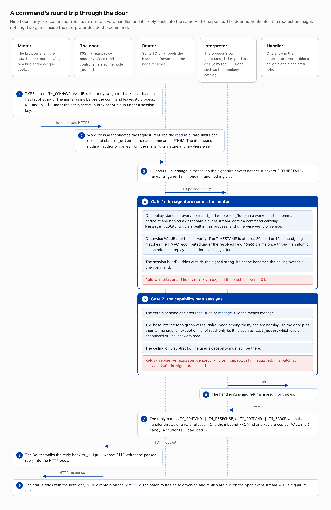
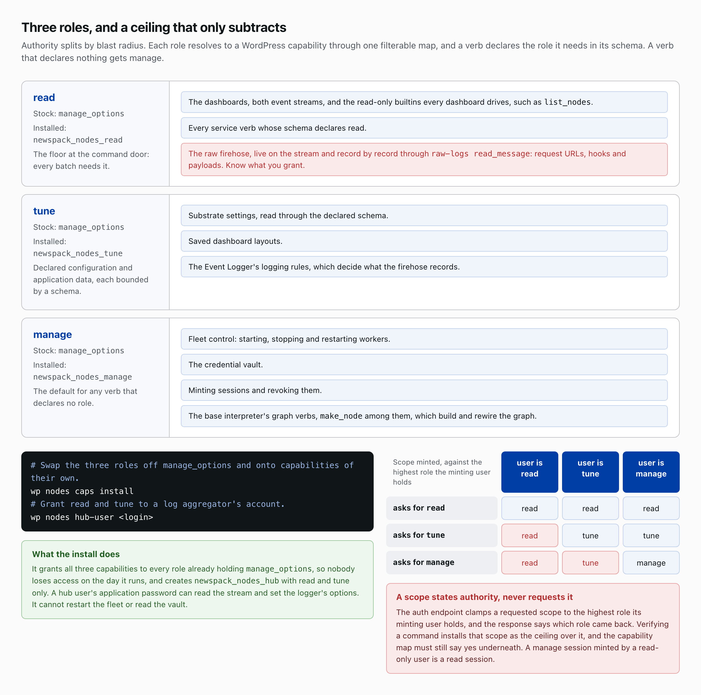
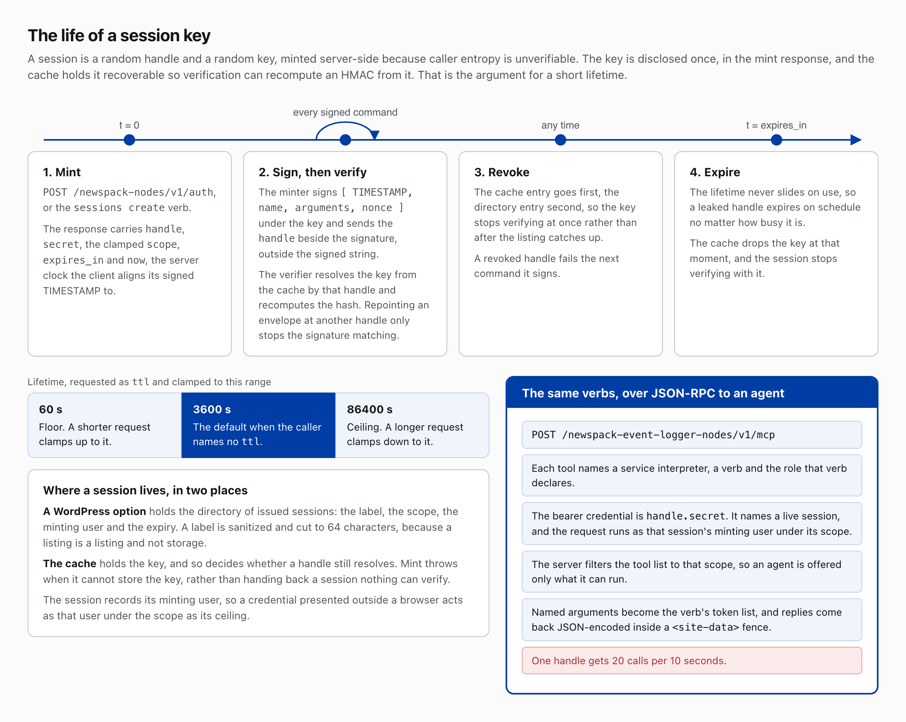

# Commands, capabilities and sessions

## A command is a message

Control rides the same rails as data. A command is a message carrying the TM_COMMAND bit, its value a verb name and a flat list of string arguments, and it routes by TO. Every node sinks into a [`Command_Interpreter_Node`](../includes/class-command-interpreter-node.php), the process's `_command_interpreter`, which holds a table of verbs and, once TO is peeled empty, looks the verb up and calls its handler. A service like the topology catalog subclasses [`Service_CI_Node`](../includes/class-service-ci-node.php), declaring each verb with a handler and a role.

## The minter signs

WordPress can name the sender of a REST request, but not the builder of a message once it has crossed into a worker. [ADR-15](architecture-decisions.md#adr-15-command-authorization-local-taint--the-minter-signs) answers with the minter's own signature: an endpoint that signed whatever arrived would be an oracle. [`wp nodes cli`](cli.md) signs under the site's secret; a browser or a hub signs under a session key. The door, [`POST /newspack-nodes/v1/command`](API.md#command-dispatch), takes a batch of commands, authenticates the request, requires the read role, rate-limits per user, stamps its node name `_output` onto each command's FROM, and signs nothing.

Inside one process a command needs no signature: it carries an eighth element, [`Message::LOCAL`](../includes/class-message.php), which packing drops and unpacking refuses, so it cannot cross a boundary. A command arriving over the wire carries instead, under an `auth` key, an HMAC over its timestamp, verb, arguments and a single-use nonce; TO and FROM change in transit and stay unsigned. Every interpreter, in a worker, at the door and behind a dashboard's event stream, holds one policy, the first gate: admit LOCAL, otherwise verify or refuse. The timestamp is at most twenty seconds old or ten ahead, the hash matches under the resolved key, and the nonce claims once by atomic cache add, so a replay fails under a valid signature. A refused signature answers `unauthorized: <verb>` and a 401.

The second gate is the capability map. A verb's schema declares read, tune or manage; silence means manage. The base interpreter's graph verbs, `make_node` among them, declare nothing, so the door pins them at manage, with an exception list of read-only builtins such as `list_nodes`, which every dashboard drives, at read. A capability refusal answers `permission denied: <role> capability required` under a 200: the signature passed.

The reply carries TM_COMMAND with TM_RESPONSE, or with TM_ERROR when the handler throws or a gate refuses; its TO is the inbound FROM, so it walks back to `_output`, whose `fill` writes it into the HTTP body. The status rides with the first reply: 200 when a reply is on the wire, 202 when the batch routes on to a worker and replies are due on the open event stream, and 401 when any signature fails.

## Three roles

Three roles split authority by blast radius, each resolving to a WordPress capability through one filterable map. `read` covers the dashboards, both event streams and the read-only builtins, and reaches the raw firehose through `raw-logs read_message`, where request URLs, hooks and payloads live. `tune` covers substrate settings, saved dashboard layouts and the Event Logger's logging rules. `manage` covers fleet control, the credential vault, sessions and the graph verbs. On a stock install all three resolve to `manage_options` until [`wp nodes caps install`](cli.md#capabilities-and-the-hub-user) swaps in `newspack_nodes_read`, `newspack_nodes_tune` and `newspack_nodes_manage`, grants all three to every role holding `manage_options`, so nobody loses access on the day it runs, and creates `newspack_nodes_hub` with read and tune only. [`wp nodes hub-user <login>`](cli.md#capabilities-and-the-hub-user) grants those two to a log aggregator's account, whose application password can then read the stream and set the logger's options but cannot restart the fleet or read the vault.

Verifying a command installs the session's scope as a ceiling over that one command. The ceiling only subtracts, since the map must still say yes underneath, and the auth endpoint clamps it to the highest role the minting user holds, so a manage session minted by a read-only user is a read session.

## Sessions

A browser cannot hold the site's secret, since anyone at wp-admin can read it, so it asks for a session. [`POST /newspack-nodes/v1/auth`](API.md#establishing-a-session), or the `sessions create` verb, mints a random handle and key, server-side because caller entropy is unverifiable, and returns both with the clamped scope, `expires_in` and `now`, the server clock the client aligns its signed timestamp to; that response is the only place the key is disclosed, under the field name `secret`, which is what makes every redactor mask it. Verification recomputes an HMAC from the key, so the cache holds it recoverable rather than hashed; that is the argument for a short lifetime. The lifetime, requested as `ttl`, defaults to 3600 seconds, clamps between 60 and 86400, and never slides on use, so a leaked handle expires on schedule. The handle rides beside the signature, unsigned, and resolves the key; repointing an envelope at another handle only stops the signature matching. An option lists issued sessions, each with its label, cut to 64 characters, its scope, its minting user and its expiry. The cache holds the key and decides whether a handle still resolves; mint throws when it cannot store the key rather than hand back a session nothing can verify, and revoking drops the cache entry before the option's, so the key stops verifying at once.

## The Event Logger's MCP server

The Event Logger hands the same verbs to an agent over [JSON-RPC](https://www.jsonrpc.org/specification) at [`POST /newspack-event-logger-nodes/v1/mcp`](https://github.com/Automattic/newspack-event-logger-nodes/blob/main/docs/API.md#mcp), each tool naming a service interpreter, a verb and its role. The bearer credential, `handle.secret`, names a live session, and the request runs as that session's minting user under its scope. The server filters the tool list to that scope, named arguments become the verb's token list, replies come back JSON-encoded inside a `<site-data>` fence, and one handle gets twenty calls per ten seconds.

## Read more

- [`architecture-decisions.md`, ADR-15](architecture-decisions.md#adr-15-command-authorization-local-taint--the-minter-signs)
- [`API.md`](API.md), the [Command Signing](API.md#command-signing) and [Command Dispatch](API.md#command-dispatch) sections
- [`includes/class-capabilities.php`](../includes/class-capabilities.php), whose file docblock is the capability model on one page
- [`newspack-event-logger-nodes/includes/app/class-mcp-controller.php`](https://github.com/Automattic/newspack-event-logger-nodes/blob/v0.96.0/includes/app/class-mcp-controller.php)

