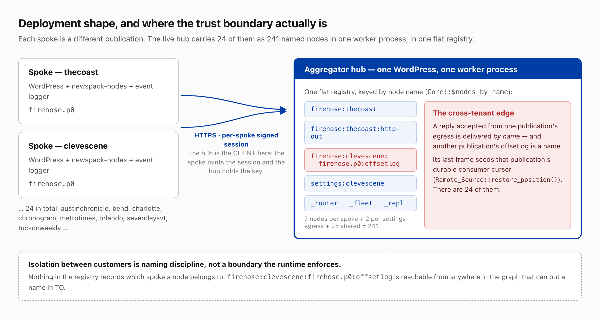
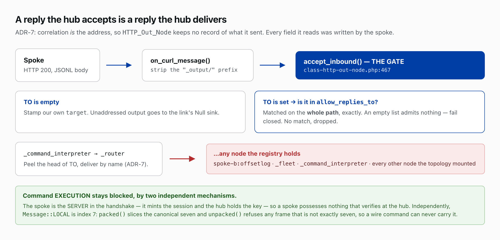
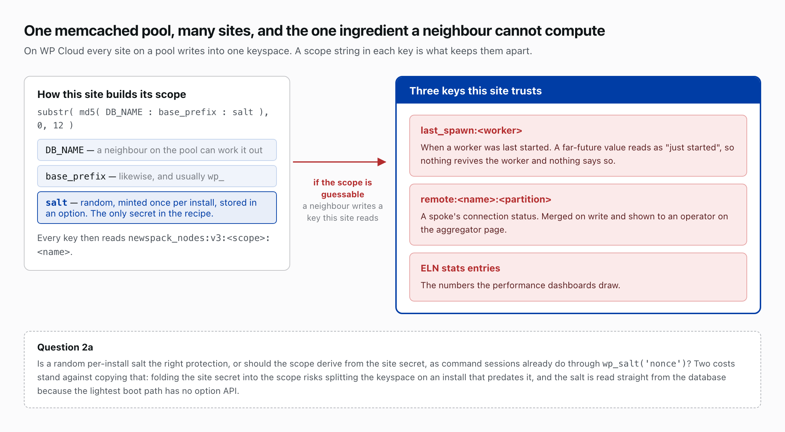

# Security model

This document describes the trust boundaries of the newspack-nodes substrate as they stand: the actors it treats as adversaries, what each boundary admits and refuses, the code that enforces it with file and line references, the tradeoffs chosen and the reason for each, and what has not been examined. The event logger, which writes the firehose the hub copies, describes its own boundaries in [its security model](https://github.com/Automattic/newspack-event-logger-nodes/blob/main/docs/security-model.md); a boundary both plugins touch is described here when the substrate enforces it and there when the logger does.

## Deployment shape

The `newspack-nodes` **hub** pulls log data over HTTPS from 24 **spokes** (23 publications and a dev site) into one `aggregator-hub` worker. The event logger on each spoke writes each request's performance to the firehose, which the hub copies raw.

## Vocabulary

[Message Format](architecture-guide.md#message-format), [Node Base Contract](architecture-guide.md#node-base-contract) and [Router](architecture-guide.md#router) in the architecture guide define message, `FROM`, `TO`, node, sink, router, reply and topology; [Storage: Topic + Partition](architecture-guide.md#storage-topic--partition) defines the partition and the offsetlog. Two facts carry this document: the router reaches whatever `TO` names, and a reply copies the request's `FROM` into its `TO`, with no table of pending requests ([ADR-7](architecture-decisions.md#adr-7-sink-vs-target-and-tofrom-replies)).

## Attacker model

The substrate defends against these actors:

- **A compromised spoke.** An authenticated peer that writes every field of every reply it sends, `TO` included, and can address any node in the hub worker's table.
- **A neighbour on the shared cache pool.** Another site on the same WP Cloud memcached pool, which can write any key whose scope it can guess.
- **An anonymous visitor.** A request whose URL or headers carry bytes chosen to land in a log or to overflow a boundary.
- **A holder of a `read` session.** A dashboard user, or an agent holding a read-scoped session, with the lowest capability the substrate grants; it reaches the raw firehose and every registered log source.
- **A hostile page a `read` user visits.** A page that opens a stream in that user's name.
- **A holder of database write access.** An actor that can plant a value in an option row without going through the code that seals it.
- **The operator's terminal.** The display that renders whatever a log holds, including bytes a visitor chose.

A holder of `manage` is administrator power by another name and is not treated as an adversary. The operator's own config file is read as written.

## The hub/spoke trust boundary

**Code:** [`includes/class-http-out-node.php`](../includes/class-http-out-node.php): [`accept_inbound()`](../includes/class-http-out-node.php#L467), [`admit_addressed()`](../includes/class-http-out-node.php#L795), [`allow_replies_to()`](../includes/class-http-out-node.php#L844), [`$reply_allowlist`](../includes/class-http-out-node.php#L112); [`includes/class-router-node.php`](../includes/class-router-node.php): `fill()`; [`includes/class-remote-link-node.php`](../includes/class-remote-link-node.php): [`address_null_sink()`](../includes/class-remote-link-node.php#L572), [`deliver_downstream()`](../includes/class-remote-link-node.php#L634), [`admit_inbound()`](../includes/class-remote-link-node.php#L663); [`includes/class-remote-source-node.php`](../includes/class-remote-source-node.php): [`forward_line()`](../includes/class-remote-source-node.php#L227); [`topologies/settings-sync.tsl`](../topologies/settings-sync.tsl); [ADR-7](architecture-decisions.md#adr-7-sink-vs-target-and-tofrom-replies).

**The reply gate.** The spoke writes every field of a reply, `TO` included, and each `HTTP_Out` node's `allow_replies_to` list decides what the hub delivers. `accept_inbound()` hands each addressed reply to `admit_addressed()`, which tests its `TO` against `$reply_allowlist`, filled by the `allow_replies_to` config verb, and drops a reply addressed outside it. The list fails closed: an `HTTP_Out` with no declaration delivers no reply at all. `Remote_Link_Node::address_null_sink()` gives a spoke's unaddressed output a `Null` target, so it lands nowhere rather than travelling on as it stands. `topologies/settings-sync.tsl` shows the declaration shape, one `cmd <egress>:config allow_replies_to settings-sync` per spoke egress. The logger's [hub and spoke wiring](https://github.com/Automattic/newspack-event-logger-nodes/blob/main/docs/architecture-guide.md#hub-vs-spoke-topology) mounts these nodes.

**Every inbound leg of a link takes the same rule.** With a target set, an unaddressed message takes it and an addressed one is dropped; with none, an addressed message passes only to a destination this side declared, and nothing declared means nothing addressed passes. `Remote_Link_Node::admit_inbound()` carries that for the stream leg and hands an addressed, target-less message to the `:http-out` sibling's `admit_addressed()` rather than keeping a second list, so a channel has one declaration for both of its legs. `Remote_Source_Node` overrides `admit_addressed()` for the firehose relay and consults no list: a firehose record carries no `TO`, so every addressed line is refused — the patron's list declares the link's own name for the heartbeat, which must not admit a spoke addressing the link. Refusing CONSUMES the line: the cursor advances by the record's own crumb, so the refusal is not poison and no spoke can wedge the relay with one addressed record. A legitimate firehose record carries no `TO` at all, so the refusal costs a correctly wired spoke nothing.

**A spoke cannot run a command on the hub.** Only the spoke mints sessions, and they sign the hub's commands to the spoke; [`Worker_Base:246`](../includes/class-worker-base.php#L246) installs the HMAC check in every hub process; and `Message::LOCAL` cannot cross the wire. [Command authorization (two-tier)](architecture-guide.md#command-authorization-two-tier) and [ADR-15](architecture-decisions.md#adr-15-command-authorization-local-taint--the-minter-signs) cover signing.

### What an accepted `TO` can reach

An accepted `TO` reaches any node's `fill()` in the hub worker's process; the four `complete` workers have their own tables. `ls` on the staging hub lists 241 names for 24 spokes: seven per spoke (a `Remote_Source` with its `:config`, `:sse-in`, `:http-out`, `:null`, `firehose.p0:offsetlog` and `:deadletter`), two per settings egress, and 25 shared. The table sorts all 40 `fill()` methods by what an unsigned spoke-written message makes each do.

| Effect | Classes in the hub process | What a spoke-authored message does |
|---|---|---|
| **Appends it** | `Partition` (each spoke's offsetlog and deadletter, the firehose partitions behind `Topic`, the `topicprobe` log); `Log`, VALUE bytes only | Writes it, size-capped. **An offsetlog's last frame is where that spoke's reader resumes**, so a forged frame moves the hub's read position: the gate exists for this. |
| **Sends it outward** | `HTTP_Out` (per spoke and per settings egress), `Remote_Link` | Batches it to the spoke the node fronts, a relay whose ingress applies this same table. |
| **Stages configuration** | `Settings_Sync` | Re-sends one registered option to its registered destination. |
| | `Discovery_Collector` | Adds hook and event names, through `sanitize_text_field`, to the hub-wide lists the rule editor offers, 10,000 per list. |
| **Interprets it** | `Command_Interpreter` | HMAC-verifies a command with empty `TO`; an unsigned one draws a `TM_ERROR` reply back along `FROM`. Forwards anything else. |
| **Forwards, filters or discards** | `Null`, `SSE_In`, `Callback` (discard); `Remote_Job_Rewrite`, `Echo`, `Tee`, `Tap`, `Grep`, `Age_Sieve`, `Value_Timeout`, `JSON_To_Struct`, `Struct_To_JSON`, `Lock`; `Topic_Probe`, `Fleet` and `Consumer`, which have no `fill()` and take the base forward | Re-addresses or drops, then returns it to the router and this table. The base forward fills an emptied `TO` from the node's default, so a message addressed to `topicprobe` lands in the probe log. |
| **Not in this process** | `Shell`, `Hook`, `Table`, `Job_Worker`, `Flame_Builder` and its `:auto-tuner`, `Graphite`, `Stdout`, `Stderr`, `Dumper`, `SSE_Out`, `HTTP_In`, `Probe_To_Graphite`, `Request_Builder`, `Job_Router` | Reaches nothing: `Topology_Loader` constructs a `Shell` without registering it, `Table_Node::table()` constructs without naming, and no hub topology makes a `Hook`. |

`Shell`, which parses text into commands signed with the process key, would matter most; no worker's graph holds it. The `_repl` node a console talks to is a partition.

**The boundary lives in topology config.** Each `allow_replies_to` declaration is a hand-written hole: 48 on the staging hub, `settings-sync` and `discovery-collector` on each of 24 settings egresses. A missed one silently drops that spoke's discovery replies, indistinguishable from a spoke with nothing to report. The alternative, `HTTP_Out` admitting only replies to the `FROM` values it mints per batch, is correlation state, which [ADR-7](architecture-decisions.md#adr-7-sink-vs-target-and-tofrom-replies) refuses.

**The reply leg honours a spoke-set `TO`.** Routing every reply to the link's default destination would remove the allowlist and its 48 declarations, at the cost of one `HTTP_Out` per reply destination instead of one per link.

Both choices are open; see [Tradeoffs](#tradeoffs).

## The shared-memcache salt

**Code:** [`includes/class-cache-backend.php`](../includes/class-cache-backend.php): `site()` ([181](../includes/class-cache-backend.php#L181), [196](../includes/class-cache-backend.php#L196)), [`salt()`](../includes/class-cache-backend.php#L482), [`ensure_salt()`](../includes/class-cache-backend.php#L445), the keyspace-split warning ([160-179](../includes/class-cache-backend.php#L160-L179)); [`includes/class-command-auth.php`](../includes/class-command-auth.php): [`session_address()`](../includes/class-command-auth.php#L537).

On WP Cloud one memcached pool serves many sites, so every key carries a per-install scope, `substr( md5( DB_NAME . ':' . base_prefix . ':' . salt() ), 0, 12 )`. A neighbour can work out the database name and the prefix, so only the salt keeps the scope unguessable, and a guessable scope lets that neighbour write a key this install reads. `Bootstrap::activate()` and the `admin_init` self-heal ([`includes/class-bootstrap.php:263`](../includes/class-bootstrap.php#L263), `:284`) call `ensure_salt()`, which mints one only where none exists. Three readers trust such keys: `Spawn_Coordinator::load_spawn_ts()` reads `last_spawn:`, where a planted far-future timestamp reads as a worker just started, so nothing revives it; `Aggregator_CI` shows `remote:{name}:{partition}`, the connection status `write_status()` merges; and the logger's [`Stats_Store`](https://github.com/Automattic/newspack-event-logger-nodes/blob/v0.96.0/includes/class-stats-store.php) feeds the performance dashboards.

The scope is a random per-install salt rather than a derivation from the site secret, which is what `session_address()` does for command sessions; its comment says *"the cache is shared infrastructure, not a trusted store."* Two facts argue against copying it. Folding `wp_salt('nonce')` into `site()` risks the split keyspace `site()`'s docblock warns about, and `wp_salt()` is unavailable under the SHORTINIT boot, where `salt()` reads the option row through `$wpdb` instead. Rotating that salt is the logger's schema migration; the logger's [security model](https://github.com/Automattic/newspack-event-logger-nodes/blob/main/docs/security-model.md#tradeoffs) records the choice.

## The inbound `FROM` ceiling at `/command`

**Code:** [`includes/class-node.php`](../includes/class-node.php): [`stamp_message()`](../includes/class-node.php#L310), [`can_stamp()`](../includes/class-node.php#L336), [`MAX_FROM_SIZE`](../includes/class-node.php#L39); [`includes/rest/class-http-in-node.php`](../includes/rest/class-http-in-node.php): [`dispatch()`](../includes/rest/class-http-in-node.php#L258), [`boundary_refusal()`](../includes/rest/class-http-in-node.php#L326).

`MAX_FROM_SIZE` caps `FROM` at 1,024 bytes; [Message Format](architecture-guide.md#message-format) covers the ceiling. `/command` checks it through `can_stamp()` before accepting a message and answers an overflow with a refusal frame, because the boundary can name the door an overflow came in by and the router, a layer later, cannot ([`includes/class-http-out-node.php:450`](../includes/class-http-out-node.php#L450)). Enforcement inside the process rests on convention: `stamp_message()` returns `false`, its docblock says *"the caller must drop the message on either"*, and a caller that ignores the return compiles, passes review and ships.

## What reaches the operator's terminal

**Code:** [`includes/class-core.php`](../includes/class-core.php): [`terminal_safe()`](../includes/class-core.php#L622), [`CONTROL_CLASS`](../includes/class-core.php#L56), [`CONTROL_SCAN`](../includes/class-core.php#L73); [`includes/class-stdout-node.php`](../includes/class-stdout-node.php): [`write()`](../includes/class-stdout-node.php#L110), `write_raw()`; [`includes/class-tty-out-node.php`](../includes/class-tty-out-node.php); [`includes/class-log-sources.php`](../includes/class-log-sources.php): `tail_file()`.

A visitor's URL or `User-Agent` carrying the escape byte `0x1B` reaches `wp-content/debug.log` through a PHP notice, and `taillog debug` in `wp nodes cli` prints it to the operator's terminal. Every terminal writer passes its text through `Core::terminal_safe()`, which renders each control character as a visible token such as `<1B>`, inverse video on a TTY, because a stripped byte hides the attack from the reader. `CONTROL_CLASS` is `[\x00-\x08\x0B-\x1F\x7F-\x9F]`; `CONTROL_SCAN` adds the C1 range in UTF-8 (`\xC2[\x80-\x9F]`). `Stdout_Node::write_raw()` bypasses it for a caller composing a sequence on purpose, and the console's `clear` command is its only user.

**Rendering rather than refusing, for a UTF-8 terminal.** `terminal_safe()` refuses nothing, where [`Health_Probe_Client::valid_result()`](../includes/class-health-probe-client.php) refuses a remote health message carrying any control, line-separator or paragraph-separator character: that message has a fixed shape, and a log tail holds whatever the log holds. It defends UTF-8 mode, the mode every terminal reading these logs runs in; another mode means escaping every high byte and mangling every non-ASCII log line.

## The Vault's cryptography

**Code:** [`includes/class-vault.php`](../includes/class-vault.php): [`encrypt()`](../includes/class-vault.php#L311), [`decrypt()`](../includes/class-vault.php#L475), [`encryption_key()`](../includes/class-vault.php#L499), [`require_sodium()`](../includes/class-vault.php#L513), [`get_all()`](../includes/class-vault.php#L438); [`includes/rest/class-vault-ci-node.php`](../includes/rest/class-vault-ci-node.php): the `add` and `update` verbs.

The Vault seals each password with [`sodium_crypto_secretbox`](https://www.php.net/manual/en/function.sodium-crypto-secretbox.php), keyed by [`sodium_crypto_generichash`](https://www.php.net/manual/en/function.sodium-crypto-generichash.php)`( wp_salt( 'auth' ), '', 32 )` under a fresh `random_bytes` nonce, and stores it in an option as `$enc$` plus the base64 of nonce and ciphertext. Without libsodium `encrypt()` and `decrypt()` throw through `require_sodium()`, so `vault add` and `vault update` fail loudly rather than store. [Service CIs](architecture-guide.md#repl-wp-nodes-cli) and [Command authorization (two-tier)](architecture-guide.md#command-authorization-two-tier) cover the Vault's place in the command channel.

- **The key derives from the auth salt.** Rotating `AUTH_KEY` or `AUTH_SALT` makes every sealed value unreadable, with no re-key path.
- **An unsealed stored value reads as empty.** `add()` and `update()` always seal, so a password without the `$enc$` prefix can only come from database write access, and `get_all()` treats it as empty. The option is the only source; the config file declares no Vault entry.

## The JavaScript surface

**Code:** the 314 non-test JavaScript files under the two `src/` trees, this plugin's and the logger's.

- **One HTML sink**, the logger's [`src/overview/PerformanceDashboard.js:852-856`](https://github.com/Automattic/newspack-event-logger-nodes/blob/v0.96.0/src/overview/PerformanceDashboard.js#L852-L856), is a `<script type="application/json">` element of page facts; `factsJson()` escapes `<` to `\u003C` and both Unicode line terminators, the correct guard for that context.
- **One `href` built from data**, the logger's [`src/current-request/CurrentRequestTab.js:162`](https://github.com/Automattic/newspack-event-logger-nodes/blob/v0.96.0/src/current-request/CurrentRequestTab.js#L162), joins an admin URL PHP supplies to `encodeURIComponent( rid )`.

Everything else renders through React text nodes; browser storage holds layout, theme, panel heights and telemetry counters; the two `style` values built from data are numeric percentages; and neither tree holds an `innerHTML`, `eval`, `new Function`, `document.write` or `postMessage` listener.

The [browser runtime](architecture-guide.md#browser-topology-console-srctopology-console-srcruntime) carries no reply allowlist on its `HttpOutNode`, because its remote is the server the operator is logged into and the browser itself mints every address that comes back ([`src/runtime/http-out-node.js:277`](../src/runtime/http-out-node.js#L277)).

Every `@wordpress/*` runtime package is pinned to the `wp-7.0` dist tag, and each build externalises them to the copy WordPress loads. An advisory reachable only past the pin is dismissed with a written reason.

## The other doors

**Code:** [`includes/rest/class-auth-controller.php`](../includes/rest/class-auth-controller.php) ([110](../includes/rest/class-auth-controller.php#L110)), [`includes/rest/class-spawn-controller.php`](../includes/rest/class-spawn-controller.php) ([84-97](../includes/rest/class-spawn-controller.php#L84-L97), [252](../includes/rest/class-spawn-controller.php#L252)), [`includes/rest/class-health-cache-controller.php`](../includes/rest/class-health-cache-controller.php) ([89-97](../includes/rest/class-health-cache-controller.php#L89-L97)), [`includes/rest/class-http-in-node.php`](../includes/rest/class-http-in-node.php) ([184-187](../includes/rest/class-http-in-node.php#L184-L187), [384](../includes/rest/class-http-in-node.php#L384)), [`includes/rest/class-sse-out-node.php`](../includes/rest/class-sse-out-node.php) ([1117-1123](../includes/rest/class-sse-out-node.php#L1117-L1123)); [`includes/class-command-interpreter-node.php`](../includes/class-command-interpreter-node.php): [`READ_VERBS`](../includes/class-command-interpreter-node.php#L163), [`capability_for()`](../includes/class-command-interpreter-node.php#L356); [`includes/class-log-sources.php`](../includes/class-log-sources.php): [`parse_entry()`](../includes/class-log-sources.php#L557); [`includes/class-config.php`](../includes/class-config.php): [`assert_within_base()`](../includes/class-config.php#L110); [`includes/rest/class-topologies-ci-node.php`](../includes/rest/class-topologies-ci-node.php) ([603](../includes/rest/class-topologies-ci-node.php#L603)); [`includes/class-job-worker-node.php`](../includes/class-job-worker-node.php) ([207-218](../includes/class-job-worker-node.php#L207-L218)).

[Secure levels](architecture-guide.md#secure-levels) and [Command authorization (two-tier)](architecture-guide.md#command-authorization-two-tier) cover capabilities and sessions. Every other substrate door checks what it should:

| Door | Who opens it | What it checks |
|---|---|---|
| [`POST /v1/auth`](API.md#establishing-a-session), minting a command session | `read` | Fleet gate; scope clamped to the caller's roles; lifetime 60 seconds to one day. |
| [`POST /v1/workers/spawn`](API.md#worker-spawn) | An internal 10-second token, or `manage` with a nonce at one call per two seconds | Token, capability, rate limit, nonce, in that order; type and partition checked against the active set. |
| [`POST /v1/health/cache`](API.md#internal-cache-health) | An internal token | Shape, then HMAC with the purpose inside the hash; the handler reads nothing from the request. |
| [`POST /v1/command`](API.md#command-dispatch) | `read`, and at most 30 requests per user per second, 429 past that | HMAC on every wire command; a role on every verb; the graph vocabulary pinned to `manage`. |
| Both event streams, [`GET /v1/log/stream`](API.md#log-stream) and [`GET /v1/messages/stream`](API.md#sse-stream) | `read`, no nonce | Roots confined to the three log groups; `..` refused. |
| The two `admin_post` handlers, reset settings and flush cache (the logger registers a third, its own reset) | `manage` with a nonce | Nonce, then capability. |
| The settings page, sole writer of `log_sources`, `memcache_servers`, `base_directory` and the TLS toggles | Literal `manage_options` | WordPress enforces `manage_options` on the option group; `settings set` accepts only bounded integers. |
| `sessions`, `vault`, `workers restart` and `topologies` verbs | `manage` | Names through one regex; integers through a refusing read; URLs `https://` only. |
| `layouts save` | `tune` | Name, size and every coordinate, before a byte is written. |
| `wp nodes ingest`, `scaffold`, `cli`, `run` | A shell as the site user | Root refused; input files must exist; `ingest` does not confine its destination, which a shell reaches anyway. |
| The TLS toggles `spawn_verify_ssl`, `vault_verify_ssl`, `vault_require_ssl` | The config file | Default on; the Vault refuses `http://` regardless; the last matters only for a url planted in the option by database write. |

The logger's MCP server and profiler mu-plugin are two more doors, described in [its security model](https://github.com/Automattic/newspack-event-logger-nodes/blob/main/docs/security-model.md#the-other-doors).

Three need a paragraph each.

**`read` reaches every registered log source.** `taillog` is one of the fifteen read-only builtins in `READ_VERBS` that `capability_for()` exempts from the `manage` floor on the command endpoint, and the log stream itself needs only `read`, so any `read` holder can pull the last 64 KB of the PHP error log. That is by design: the capability's docblock says `read` reaches the raw firehose.

**`log_sources` accepts any absolute path.** An administrator adds `name=/path`; `parse_entry()` refuses only a relative path, `..` and NUL. With the paragraph above, adding `wp-config.php` hands every `read` account the salts the command-signing secret and the Vault key derive from. Only `manage_options` can add a source, so this is a mistake rather than an escalation.

**What `manage` can mount.** A worker evaluates a saved topology as trusted local commands, so a `manage` holder mounts any node class, `Hook` included, which fires a WordPress action with the payload. `assert_within_base()` confines every storage path to the runtime directory, lexically with `..` resolved, so nothing lands in the webroot. `manage` is administrator power by another name, and the model treats it so.

A spoke's job runs on the hub through `Job_Worker_Node` (`includes/class-job-worker-node.php:207-218`) and the logger's [`Remote_Job_Rewrite`](https://github.com/Automattic/newspack-event-logger-nodes/blob/v0.96.0/includes/class-remote-job-rewrite-node.php); the logger's [security model](https://github.com/Automattic/newspack-event-logger-nodes/blob/main/docs/security-model.md#the-remote-job-rewrite) states that requirement.

## Tradeoffs

Each choice below is made and reasoned; where the question stays open, the paragraph says so.

- **Multi-tenancy is by convention.** One hub worker holds every spoke's nodes in one flat table keyed by name.
- **The reply gate is declarative.** The allowlist fails closed and each of its 48 declarations is hand-written, because the alternative is correlation state, which [ADR-7](architecture-decisions.md#adr-7-sink-vs-target-and-tofrom-replies) refuses. Which side of that trade is right is open.
- **The reply leg honours a spoke-set `TO`.** Routing every reply to the link's default destination would remove the allowlist at the cost of one `HTTP_Out` per reply destination. Whether the reply leg should honour a spoke-set `TO` at all is open.
- **The cache scope is a random per-install salt**, not a derivation from the site secret, because `wp_salt()` is unavailable under SHORTINIT and folding it into `site()` risks a split keyspace. Whether that is the right protection is open.
- **The `FROM` ceiling is enforced by convention inside the process.** `stamp_message()` returns `false` and the caller must drop the message. Whether that is mechanizable, as a `#[\NoDiscard]`-style contract or a lint rule, is open.
- **The terminal renders control characters rather than refusing them**, and defends UTF-8 mode only. Whether rendering is right for the tail, and whether UTF-8 is the right scope, is open.
- **The Vault key derives from the auth salt.** Rotating `AUTH_KEY` or `AUTH_SALT` unseals nothing and re-keys nothing. Whether a key derived from a value WordPress expects operators to rotate is the right choice is open.
- **The option is the Vault's only source, and a plaintext password in it reads as no password.** Every password the plugin stores carries the `$enc$` prefix, so a value without it in the option is tampering or a bug and `get_all()` reads it as empty. The config file declares no Vault entry, so no plaintext credential is admissible from anywhere.
- **The browser runtime's `HttpOutNode` carries no reply allowlist**, because the browser mints every address that comes back. Whether that exemption is sound is open.
- **`log_sources` refuses only a relative path, `..` and NUL.** The parser could refuse `wp-config.php` through an allowlist of roots or a denylist of extensions; whether it should is open.
- **The `@wordpress/*` `wp-7.0` pin.** Any advisory reachable only past the pin is dismissed, with a written reason.
- **The event streams carry no nonce.** A `read` user lured to a hostile page can have a stream opened in their name, but the browser withholds the body from that page, so the cost is a held slot, and the slot pool is the limit.
- **A live stream outlives the authorization that opened it.** The server checks permission once, at connect, and caps no duration, so a reader excluded afterwards keeps receiving the raw firehose until the connection drops. The client refreshes its slot lease by heartbeat; the server only checks.

## Dependencies and the release path

A [GitHub Actions workflow](../.github/workflows/release.yml) builds each release from exactly the packages the committed lockfile names; two of its four third-party actions are pinned to a commit and two to a major version the owner can move. `newspack-nodes` has no open advisory in npm or composer. Composer requires only PHP, and `vendor/` stays out of the zip.

The GitHub Release is a record, not the artifact anyone installs. Sites run a zip the deploy script builds from `main` and installs over SSH beside the site's config file, which carries no credential.

## Not examined

- **Everything outside the two plugins.** This model reads other code only where it writes the firehose or calls into the two trees, and follows nothing past that boundary.
