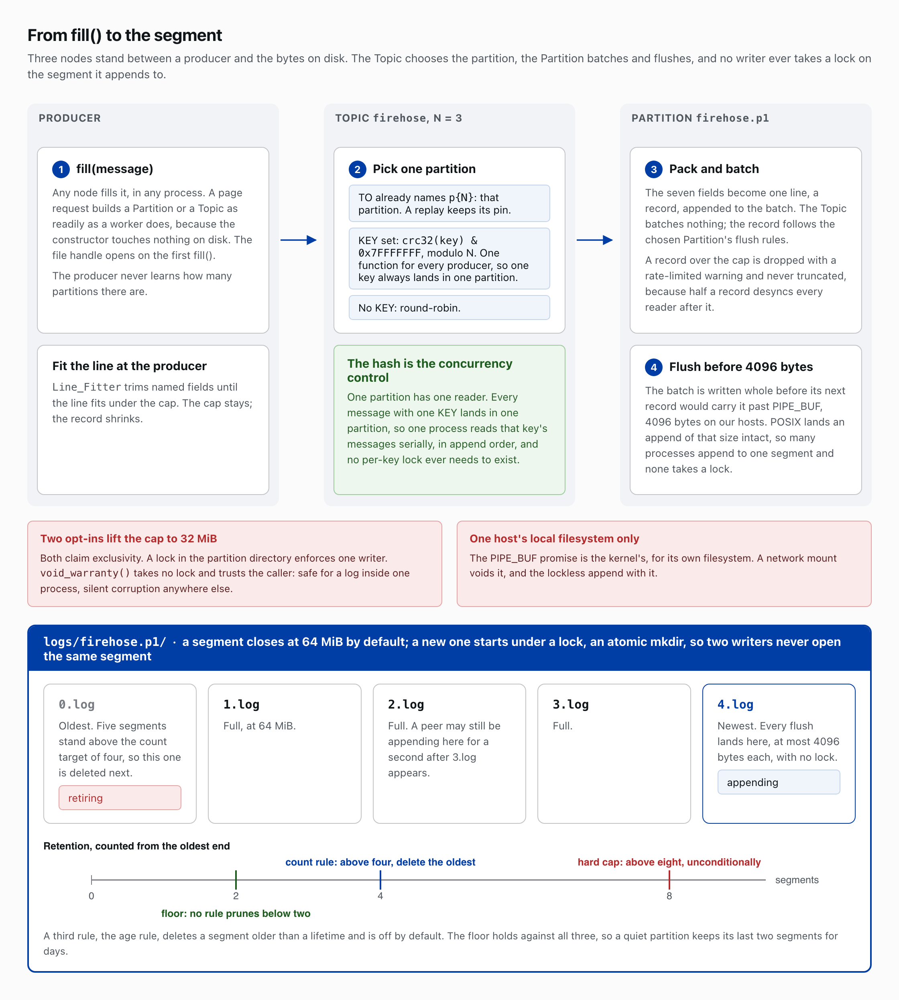
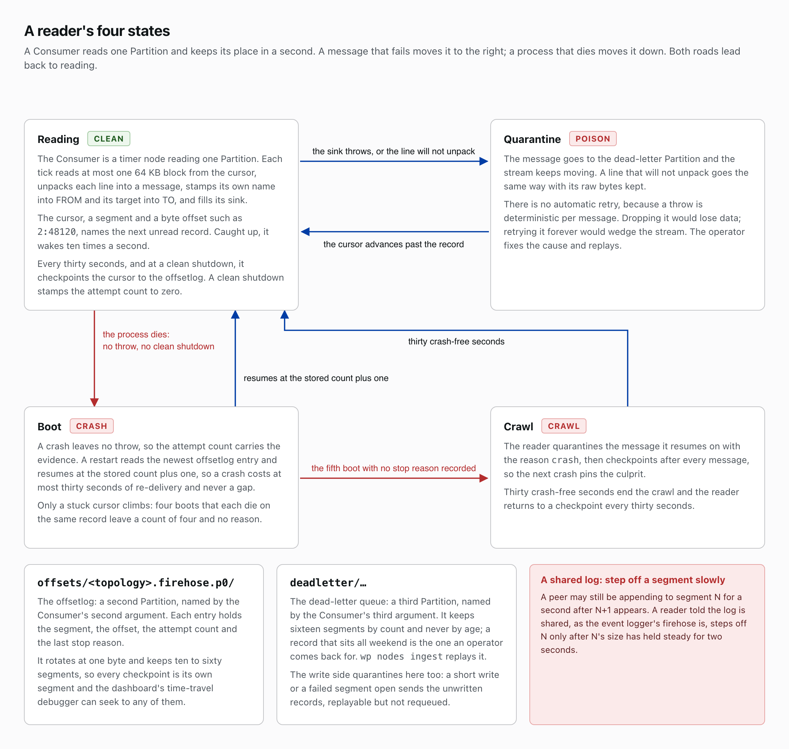
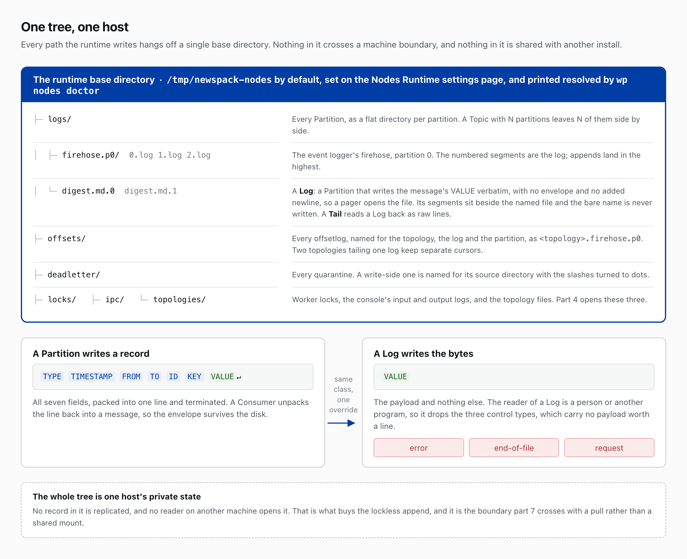

# Logs on disk

*Part 3 of 10 in Newspack Nodes and the Event Logger. Previous: The vocabulary. Next: Workers and the fleet.*

## A Partition is a directory

A Partition is a node whose `fill()` packs the seven fields into one line, a record, and appends it to the highest-numbered segment in its directory: `0.log`, `1.log`, `2.log`. Records batch, and the batch flushes before its next record would cross 4096 bytes. A segment closes at 64 MiB by default; a new one starts under an atomic `mkdir`, so two writers never open the same segment. Three retention rules prune from the oldest end and never below two segments: a count rule deletes the oldest above four, a hard cap deletes unconditionally above eight, and an age rule, off by default, deletes any segment older than a lifetime. The constructor touches nothing on disk ([ADR-5](https://github.com/Automattic/newspack-nodes/blob/v2.55.3/docs/architecture-decisions.md#adr-5-lazy-init-for-topic--partition)), so a page request writes to the same log a worker reads; the handle opens on the first `fill()`.

One partition has one reader, so a busy log wants several. A Topic fronts N Partitions and picks one per message: a TO that names a partition wins, so a replay keeps its pin; a KEY hashes by CRC32 under a 31-bit mask, modulo N, through the one function every producer calls ([ADR-6](https://github.com/Automattic/newspack-nodes/blob/v2.55.3/docs/architecture-decisions.md#adr-6-crc32--31-bit-mask-partition-routing)), so one process reads a key's messages in append order and needs no per-key lock; a keyless message goes round-robin.

That 4096 is PIPE_BUF on our hosts, and it is the whole design. POSIX lands an append of at most that size whole ([ADR-4](https://github.com/Automattic/newspack-nodes/blob/v2.55.3/docs/architecture-decisions.md#adr-4-pipe_buf-atomic-writes)), so any number of processes append to one segment without coordinating. The Partition drops a record over the cap with a rate-limited warning and never truncates it: half a record desyncs every reader after it. `Line_Fitter` keeps the cap by trimming named fields at the producer until the line fits. Two opt-ins lift it to 32 MiB by claiming an exclusivity that is yours to prove: a lock in the partition directory enforces one writer; `void_warranty()` takes no lock, safe inside one process and silent corruption anywhere else. A network mount voids the kernel's promise, and the lockless append with it.

## A Consumer resumes from its cursor

A Consumer is a timer node reading one Partition. Each tick reads at most one 64 KB block from its cursor, a segment and byte offset naming the next unread record, unpacks each line into a message, stamps its own name into FROM and its target into TO, and fills its sink. Caught up, it wakes ten times a second. Every thirty seconds, and at a clean shutdown, it checkpoints the cursor to its offsetlog, a second Partition named by its second argument, whose entries hold the segment, the offset, an attempt count and the last stop reason. A restart reads the newest entry, resumes at its cursor and raises the attempt count by one, so a crash costs at most thirty seconds of re-delivery and never a gap.

Dropping a message that fails its reader loses data, and retrying it forever wedges the stream, so the Consumer does neither ([ADR-12](https://github.com/Automattic/newspack-nodes/blob/v2.55.3/docs/architecture-decisions.md#adr-12-dead-letter-poison--crash-lifecycle)): when the sink throws, the message goes to a third Partition, the dead-letter queue named by its third argument, and the cursor advances past it. A line that will not unpack goes the same way, raw bytes kept. A throw is deterministic per message, so nothing retries; the operator fixes the cause and replays with `wp nodes ingest`. A crash leaves no throw to catch, so the attempt count in the offsetlog carries the evidence instead.

A clean shutdown stamps the count to zero, so only a stuck cursor climbs. At the fifth boot with no stop reason recorded, the reader quarantines the message it resumes on with the reason `crash` and crawls, checkpointing after every message so the next crash pins the culprit; thirty crash-free seconds end the crawl. The offsetlog rotates at one byte and keeps ten to sixty segments, so every checkpoint is its own segment and the dashboard's time-travel debugger can seek to any of them. The dead-letter queue keeps sixteen segments by count and never by age: a record that sits all weekend is the one an operator comes back for. The write side quarantines there too: a short write or a failed segment open sends the unwritten records, replayable but not requeued. A peer may still append to segment N for a second after N+1 appears, so a reader told the log is shared, as the firehose is, steps off N only after its size has held steady for two seconds.

## Where it all lives

Every path hangs off one runtime base directory, `/tmp/newspack-nodes` by default, set on the Nodes Runtime settings page. `wp nodes doctor` prints the resolved path.

`logs/` holds every Partition as a flat directory, `firehose.p0` for one. `offsets/` holds every offsetlog, named for the topology, the log and the partition, so two topologies tailing one log keep separate cursors. `deadletter/` holds the quarantines, the write-side ones named for their source directory with slashes turned to dots. `locks/` holds the worker locks, `ipc/` the console's input and output logs, and `topologies/` the topology files; part 4 opens all three. A Log is a Partition with one override: it writes the VALUE verbatim, no envelope and no added newline, so a pager opens the file, and it drops the three control types, error, end-of-file and request. Its segments sit in `logs/` beside the named file as `digest.md.0`, `digest.md.1` and so on; the bare name is never written. A Tail reads a Log back as raw lines. The whole tree is one host's private state.

## Read more

- [`newspack-nodes/docs/architecture-guide.md`](https://github.com/Automattic/newspack-nodes/blob/v2.55.3/docs/architecture-guide.md#storage-topic--partition), the [Storage](https://github.com/Automattic/newspack-nodes/blob/v2.55.3/docs/architecture-guide.md#storage-topic--partition) and [Consumer](https://github.com/Automattic/newspack-nodes/blob/v2.55.3/docs/architecture-guide.md#consumer--tail) sections
- [`newspack-nodes/docs/architecture-decisions.md`](https://github.com/Automattic/newspack-nodes/blob/v2.55.3/docs/architecture-decisions.md#adr-4-pipe_buf-atomic-writes), [ADR-4](https://github.com/Automattic/newspack-nodes/blob/v2.55.3/docs/architecture-decisions.md#adr-4-pipe_buf-atomic-writes), [ADR-6](https://github.com/Automattic/newspack-nodes/blob/v2.55.3/docs/architecture-decisions.md#adr-6-crc32--31-bit-mask-partition-routing) and [ADR-12](https://github.com/Automattic/newspack-nodes/blob/v2.55.3/docs/architecture-decisions.md#adr-12-dead-letter-poison--crash-lifecycle)
- [`newspack-nodes/docs/getting-started.md`](https://github.com/Automattic/newspack-nodes/blob/v2.55.3/docs/getting-started.md)

*Part 3 of 10 in Newspack Nodes and the Event Logger. Previous: The vocabulary. Next: Workers and the fleet.*
