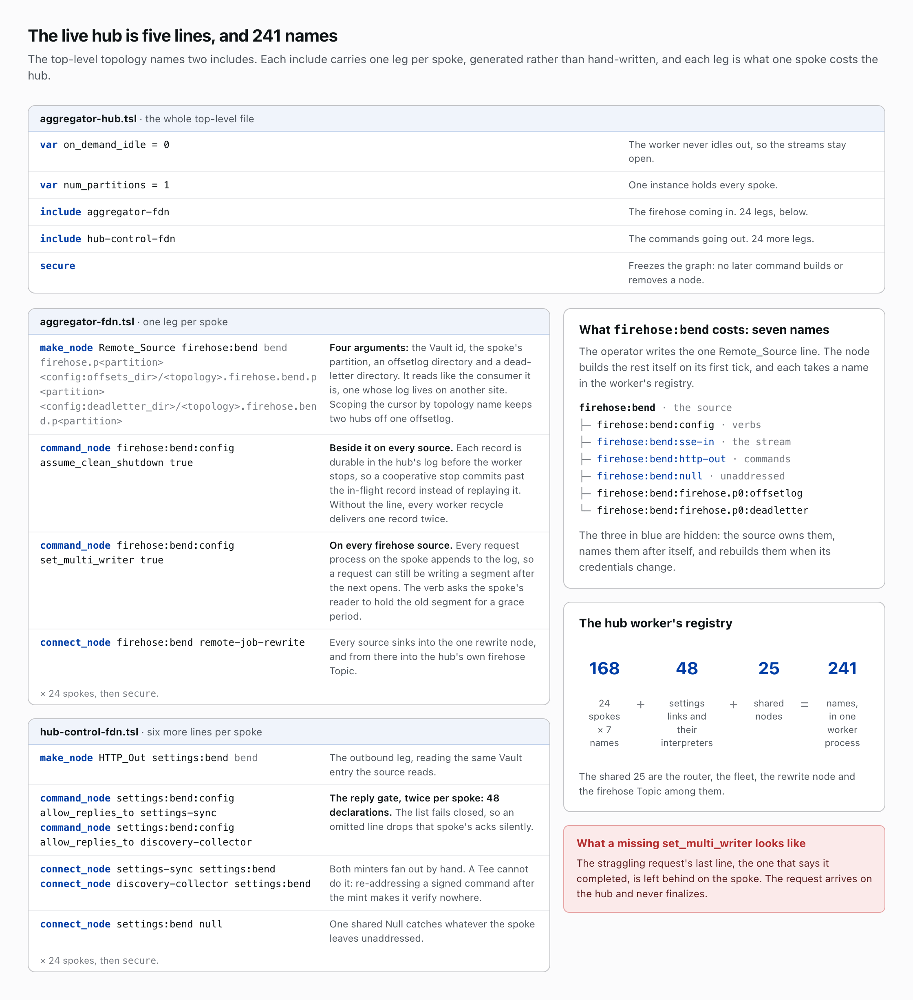

# Hub and spoke
*Part 7 of 10 in Newspack Nodes and the Event Logger. Previous: The Event Logger. Next: Dashboards and the browser runtime.*

Every site writes its own firehose. One site, the hub, copies every other site's firehose into its own; the others are spokes. The live hub pulls from 24 of them, and no spoke knows about any other. The hub is the HTTPS client in both directions, firehose in and signed commands out, so a spoke opens no connection of its own.

## Pulling a firehose

Remote_Source pulls one spoke's firehose. It is a consumer whose log lives on another site. One topology line declares it, with four arguments: the spoke's Vault id, its firehose partition, an offsetlog directory and a dead-letter directory. On its first tick it reads that Vault entry and builds three hidden nodes named after itself: `:sse-in` holds the stream open, `:http-out` posts one signed batch per tick, and `:null` takes unaddressed replies. Every request carries the hub user's WordPress application password as HTTP Basic auth.

The stream is one `GET /messages/stream` request held open as one long HTTP response, one server-sent event per record; a handshake event names the slot leased to this stream, one of a limited set, and the hub's heartbeat keeps the lease. Each record's ID is its segment, byte offset and length in the spoke's log. The source checkpoints that ID to its offsetlog and resumes from it on every reconnect. A record that will not parse is quarantined at that position, in the dead-letter partition. Above 512 KB buffered, `:sse-in` stops reading the socket and the spoke blocks on write; reading resumes under 256 KB. Silence for 45 seconds is a dead stream, and the source reconnects after a delay that doubles from one second to thirty. At startup the 24 sources connect one every half second, so no spoke answers a burst with refusals.

Before its first batch of commands, `:http-out` posts to `/auth` once for a command session, a handle and a key held under the spoke's Vault id; the node that mints a command signs it under the key of the spoke it is bound for. One `POST /command` per tick carries a heartbeat signed under this key every 15 seconds, and `set` and `get` commands ride the same batch. Commands queued before the session exists are held, and on a 401 the hub forgets the session.

The reply rides the same response, and the spoke writes every field of it, TO included. The router delivers whatever TO names, so left alone a spoke could address any node in the hub process. Every outbound node therefore carries `allow_replies_to`: a TO on the list, matched as a whole path, is delivered; any other is dropped; an empty TO goes to `:null`. A source lists its own name so its heartbeat replies reach it.

## The Vault and the hub user

The Vault is the hub's store of spokes: an HTTPS URL, a username and a password under each short id. Its tab writes entries to a WordPress option; the substrate config file can pin entries the tab cannot edit. Each password is sealed with libsodium under a key derived from the site's auth salt and opened only on the way out, so rotating that salt leaves every stored password unopenable. Workers memoize the Vault for life, so a credential change asks each worker holding a Remote_Source to reload and rebuild its hidden nodes.

The hub logs in to a spoke as a user on that spoke, holding only the hub role, the read and tune capabilities from Part 5. A stolen hub credential buys one spoke's stream and its logger settings, never its fleet or its credentials.

## The live hub

The top-level topology, aggregator-hub.tsl, is five lines: an on-demand idle of zero, so the worker never idles out; one partition, so one instance holds every spoke; the aggregator-fdn and hub-control-fdn includes; and `secure`, which freezes the graph so that no later command builds or removes a node.

Aggregator-fdn carries four lines per spoke: the Remote_Source `firehose:<spoke>`, its offsetlog and dead-letter paths carrying the topology name to keep two hubs off one offsetlog; `assume_clean_shutdown`; `set_multi_writer`; and a connect into the one rewrite node. `assume_clean_shutdown` belongs beside every source: each record is durable in the hub's log before the worker stops, so a cooperative stop commits past the in-flight record instead of replaying it, and without the line every worker recycle delivers one record twice. `set_multi_writer` belongs on every firehose source: every request process on the spoke appends to the log, so a request can still be writing a segment after the next opens, and the verb asks the spoke's reader to hold the old segment for a grace period. Without it a straggling request's last line, the one that says it completed, stays on the spoke, and the request never finalizes on the hub.

Hub-control-fdn carries six lines per spoke: an HTTP_Out `settings:<spoke>` reading the same Vault entry, two `allow_replies_to` declarations naming the settings node and the discovery node, a connect from each minter, and a connect into one shared Null. Two `allow_replies_to` lines per spoke make 48 declarations across 24 spokes, and the list fails closed, so an omitted line drops that spoke's acks silently. Part 10 argues the trade.

One Remote_Source costs the hub seven names: the source, its config interpreter, the three hidden nodes, its offsetlog and its dead-letter partition. Twenty-four spokes make 168, plus 24 settings links and their 24 interpreters, plus 25 shared nodes, the router, the fleet, the rewrite node and the firehose Topic among them: 241 names in one worker process. Nobody writes 24 legs by hand; a generator emits both includes from the list of spokes, because adding or dropping one and missing a line is the failure the repetition invites.

## Settings out, answers back, jobs in

Hub-control includes the substrate's settings-sync topology and adds the logger's pieces. A change to any `newspack_` option on the hub appends its name to a settings log; Settings_Sync tails it, reads the current value, and mints one `set` command per spoke. Every 300 seconds it re-pushes every registered option, so an offline or newly connected spoke converges. The substrate's own map sends the partition count and the six log-geometry settings, `segment_size`, `min_segments`, `num_segments`, `max_segments`, `min_lifetime` and `lifetime`, to the spoke's settings interpreter; hub-control adds rules, log memory and flush-every-line for the performance interpreter, inlining every pointer rule's hooks, so a spoke never receives a rule pointing at a table it does not hold. No Tee fans this out: a signature verifies only at the spoke it is minted for, so each minter signs once per spoke.

Discovery_Collector runs on the same 300-second cadence, minting one `get` command per spoke, addressed to that spoke's discovery interpreter. The reply is addressed TO=FROM, so it lands in the collector, which merges each spoke's registered hooks and custom event names into two staging options on the hub, sanitized and capped at 10,000 each. The rule editor's hook picker reads them; nothing here writes a rule.

Every site's job worker runs the job entries in its own firehose, and the hub must not run a spoke's as its own. Remote_Job_Rewrite, between the sources and the hub's firehose Topic, changes each entry's kind from `job` to `remote_job` and passes everything else through. The job worker picks its handler map by that kind alone, local jobs from one WordPress filter and remote jobs from another. A remote-only handler runs on the hub alone, once per aggregated entry; one registered under both runs on every site and again on the hub. The spoke cannot label its own entries, because its own worker reads the same line.

## Read more

- [`newspack-event-logger-nodes/docs/architecture-guide.md`](https://github.com/Automattic/newspack-event-logger-nodes/blob/v0.95.3/docs/architecture-guide.md), the sections ["Hub vs Spoke Topology"](https://github.com/Automattic/newspack-event-logger-nodes/blob/v0.95.3/docs/architecture-guide.md#hub-vs-spoke-topology) and ["Hub-Side Settings Sync, Discovery, and Vault"](https://github.com/Automattic/newspack-event-logger-nodes/blob/v0.95.3/docs/architecture-guide.md#hub-side-settings-sync-discovery-and-vault)
- [`newspack-event-logger-nodes/topologies/aggregator.tsl`](https://github.com/Automattic/newspack-event-logger-nodes/blob/v0.95.3/topologies/aggregator.tsl) and [`newspack-event-logger-nodes/topologies/hub-control.tsl`](https://github.com/Automattic/newspack-event-logger-nodes/blob/v0.95.3/topologies/hub-control.tsl)
- [`newspack-nodes/topologies/settings-sync.tsl`](https://github.com/Automattic/newspack-nodes/blob/v2.55.3/topologies/settings-sync.tsl)
- Part 10 of this series, on the security review

*Part 7 of 10 in Newspack Nodes and the Event Logger. Previous: The Event Logger. Next: Dashboards and the browser runtime.*
