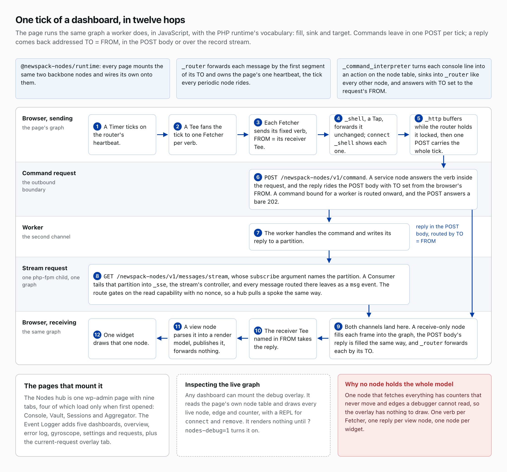
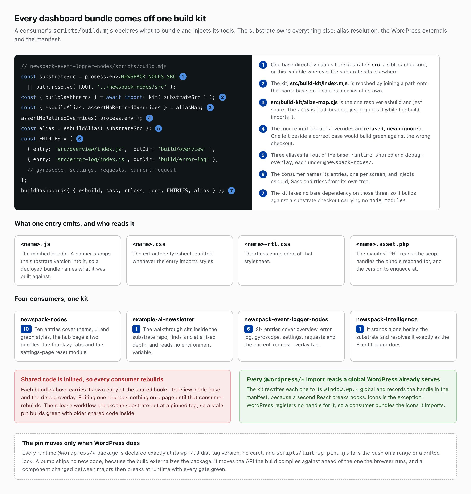

# Dashboards and the browser runtime
*Part 8 of 10 in Newspack Nodes and the Event Logger. Previous: Hub and spoke. Next: Writing a plugin and running it.*

Every dashboard in these two plugins is a React page in wp-admin, and none runs a fetch loop. Each is a topology in the browser.

## The same graph, in JavaScript

The runtime ships as `@newspack-nodes/runtime`, with the PHP vocabulary: fill, sink and target. Every page mounts `_router`, which forwards each message by the first segment of its TO and owns the page's one heartbeat, the tick every periodic node rides, and `_command_interpreter`, which turns each console line into an action on the node table and answers with TO set to the request's FROM. Every other node sinks into `_router`, the interpreter included, and each page wires its own nodes onto those two.

A Timer ticks on that heartbeat, a Tee fans the tick to one Fetcher per verb, and each Fetcher sends its fixed verb with FROM set to its receiver Tee. The reply returns with TO set to that FROM, so it lands on the receiver Tee and passes to a view node, which parses it into a render model, publishes it, and forwards nothing. One widget draws that one node. No node holds the whole model: one that fetched everything would have counters that never move and edges a debugger cannot read, so the overlay would have nothing to draw.

## The pages

The Nodes hub is one wp-admin page with nine tabs, four of which, Console, Vault, Sessions and Aggregator, load only when first opened; the Event Logger adds five dashboards, overview, error log, gyroscope, settings and requests, plus the current-request overlay tab. Any dashboard can mount the debug overlay, which reads the page's own node table and draws every live node, edge and counter, carries a REPL for `connect` and `remove`, and renders nothing until `?nodes-debug=1` turns it on. One runtime in both places buys one debugging vocabulary: a stalled dashboard is a node whose counter stopped, drawn in the overlay, rather than a promise nobody kept.

## Two channels to a worker

The page needs two channels because a request cannot wait for a worker. `_http` is the outbound boundary: it posts each message to the command endpoint, and while the router holds it locked during a tick it buffers instead, so one `POST /newspack-nodes/v1/command` carries the whole tick. A Tap named `_shell` sits in front of it and forwards every command unchanged, so `connect _shell` in a console shows each one. A verb the request answers itself replies in the POST body, with TO set from the browser's FROM. A command routed on to a worker earns a bare 202 and outlives the request; the worker writes its reply to a partition, and the reply rides the record stream from there.

That stream is `GET /newspack-nodes/v1/messages/stream`, whose `subscribe` argument names the partition. On the server one request holds one stream and one graph of its own, with the stream's controller mounted as `_sse`; a Consumer tails the partition into it, every message routed there leaves as a `msg` event, and a receive-only node in the browser fills each frame into the page's graph. The POST body's reply is filled the same way, and `_router` forwards each by its TO. The route gates on the read capability with no nonce, because a nonce would break a hub's cross-server pull of a spoke.

## The slot pool

The stream is the expensive channel. It holds one php-fpm child, one of the site's fixed pool of PHP processes, for its whole life, and a backlog of PHP requests makes the platform challenge every visitor for sixty seconds. The slot pool caps streams before the platform steps in.

Each slot is two cache keys, a permanent owner pointer and an expiring lease, and nothing else. The defaults are six streams per host, three per identity and a sixty-second lease; a hub's pull of a spoke draws on the same six, and an identity holding three has its fourth tab refused with a 429. Acquire, check and touch fail closed: with no cache backend answering, ownership is unverifiable and every stream is refused; release fails open, because a lease expires anyway. One `_heartbeat` node per page pokes the heartbeat verb every fifteen seconds, pushing the lease out another sixty; the server reads it on every drain tick, about ten times a second, and extends nothing. A slot whose lease is missing is lost: the server disconnects the stream and releases the slot, so a closed tab's slot frees itself one lease after the last poke. A 429 fails the browser's EventSource outright, and the page reopens the stream under a backoff doubling from two seconds to a thirty-second ceiling, so a tab the pool keeps refusing settles at one attempt every thirty seconds.

Six is the ceiling that leaves the site serving pages while fully subscribed, and a budget rather than a target: a host that reaches it regularly wants fewer dashboards or a larger allocation, because the headroom under it absorbs a traffic spike. Before raising `sse_max_streams`, read the live worker count from `wp nodes status`: a worker holds a php-fpm child for its whole life too, so four running workers have spent four of the same children before a single dashboard connects.

## One build kit

A consumer's `scripts/build.mjs` names its entries, one per screen, injects esbuild, Sass and rtlcss from its own tree, and calls the substrate's `buildDashboards()`. The kit takes no bare dependency on those three, so it builds against a substrate checkout carrying no `node_modules`. One entry emits four files: the minified bundle, with a banner stamping the substrate version it carries; the extracted stylesheet; its rtlcss companion; and the `.asset.php` manifest PHP reads for the script handles the bundle reaches for and the version to enqueue at.

One base directory names the substrate's `src`, a sibling checkout or `NEWSPACK_NODES_SRC`. The kit, `src/build-kit/index.mjs`, is reached by joining that path onto the base and carries no alias of its own. The `@newspack-nodes/runtime`, `shared` and `debug-overlay` aliases derive from the same base through `src/build-kit/alias-map.cjs`, the one resolver esbuild and jest share; the `.cjs` is load-bearing, because jest requires it while the build imports it. The four retired per-alias overrides are refused rather than ignored, because one left beside a correct base builds green against the wrong checkout.

Four consumers come off this kit. The substrate's ten entries cover the theme, ui and graph styles, the hub page's two bundles, the four lazy tabs and the settings-page reset module; the Event Logger's six cover its five dashboards and the current-request overlay tab; intelligence has one entry and resolves the substrate as the Event Logger does; the example newsletter has one, sits inside the substrate repo, and finds `src` at a fixed depth with no environment variable.

The kit inlines shared code. Every bundle carries its own copy of the shared hooks, the view-node base and the debug overlay, so an edit reaches a page only when that page's consumer rebuilds, and CI resolves the substrate to a pinned tag rather than to your working tree. A green release run therefore proves nothing about which substrate shipped: download the published zip and diff its `build/` against a local one.

The kit rewrites every `@wordpress/*` import except `@wordpress/icons` to the `window.wp.*` global WordPress already serves and records the handle in the manifest, because a second React breaks hooks; icons is bundled, because WordPress registers no handle for it. Each package is declared exactly at its `wp-7.0` dist-tag version, and `scripts/lint-wp-pin.mjs` fails the push on a range or a drifted lock. Never raise a pin to close an advisory: the bump hands the browser no new code and moves the API you compile against ahead of the one WordPress serves, so a component changed between majors breaks at runtime with every gate green.

## Read more

- [newspack-nodes/docs/writing-a-dashboard.md](https://github.com/Automattic/newspack-nodes/blob/v2.55.3/docs/writing-a-dashboard.md)
- [newspack-nodes/docs/writing-a-view-node.md](https://github.com/Automattic/newspack-nodes/blob/v2.55.3/docs/writing-a-view-node.md)
- [newspack-nodes/docs/sse-host-budget.md](https://github.com/Automattic/newspack-nodes/blob/v2.55.3/docs/sse-host-budget.md)
- [newspack-nodes/docs/architecture-decisions.md](https://github.com/Automattic/newspack-nodes/blob/v2.55.3/docs/architecture-decisions.md), [ADR-16](https://github.com/Automattic/newspack-nodes/blob/v2.55.3/docs/architecture-decisions.md#adr-16-js-node-class-resolution--names-are-the-tsl-surface-classes-are-the-api)

*Part 8 of 10 in Newspack Nodes and the Event Logger. Previous: Hub and spoke. Next: Writing a plugin and running it.*
