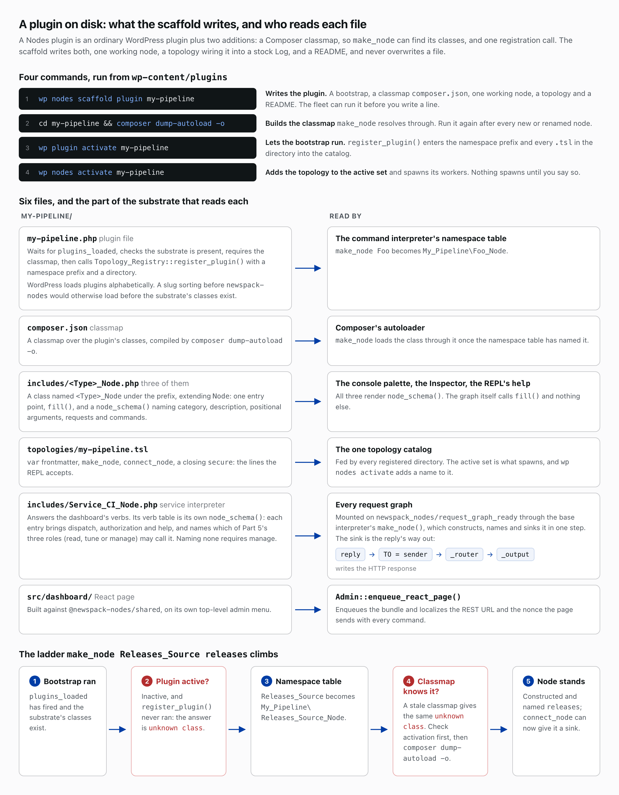
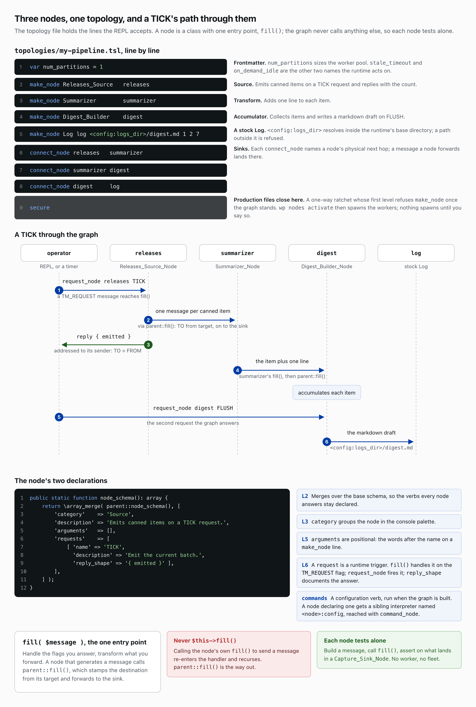
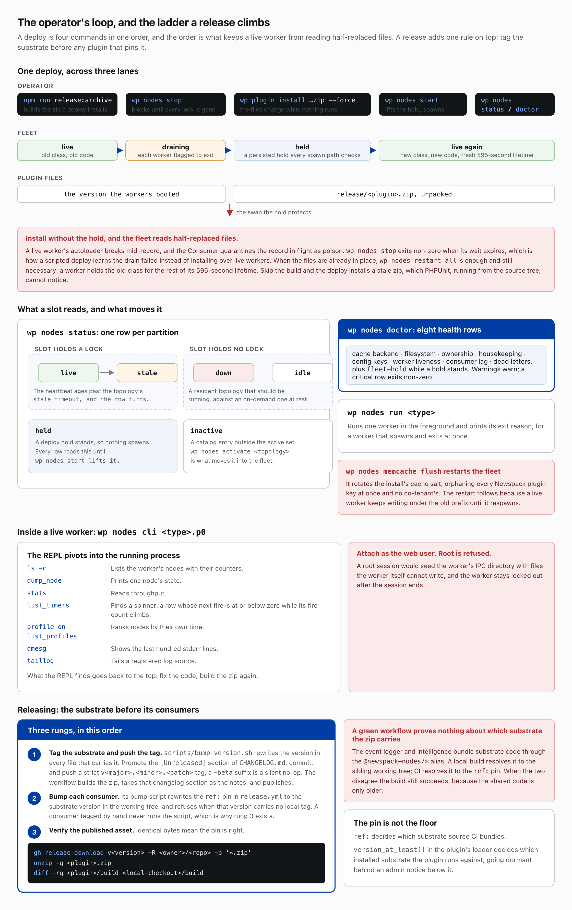

# Writing a plugin and running it
*Part 9 of 10 in Newspack Nodes and the Event Logger. Previous: Dashboards and the browser runtime. Next: What we asked SecOps to review.*

This part scaffolds a plugin, writes three nodes and a topology, runs them on the fleet and tags a release. The code follows `example-ai-newsletter`, which ships as its own zip on every substrate release and needs no API key and no network. The shipped classes carry a `_Demo` suffix, and the shipped graph is larger: two sources feed a summarizer and a scorer, and each scored item lands in a durable partition.

## Scaffold

A Nodes plugin is an ordinary WordPress plugin with two additions: a Composer classmap, so `make_node` can find its classes, and one registration call. Four commands, run from `wp-content/plugins`, stand it up. `wp nodes scaffold plugin my-pipeline` writes a bootstrap, the classmap `composer.json`, one working node, a topology wiring it into a stock Log and a README, and never overwrites a file. `composer dump-autoload -o`, run inside the new directory, builds the classmap; run it again after every new or renamed node. `wp plugin activate my-pipeline` lets the bootstrap run, and `wp nodes activate my-pipeline` adds the topology to the active set and spawns its workers; nothing spawns until you say so.

The bootstrap waits for `plugins_loaded`, because WordPress loads plugins alphabetically and a slug sorting before `newspack-nodes` would load before the substrate's classes exist. It then checks that the substrate is present, requires the classmap, and calls `Topology_Registry::register_plugin()` with a namespace prefix and a directory: `make_node Foo` resolves `My_Pipeline\Foo_Node` through the interpreter's namespace table and Composer's autoloader, and every `.tsl` in the directory enters the one topology catalog. An inactive plugin and a stale classmap both make the first `make_node` answer `unknown class`; check activation first, then rebuild the classmap.

A plugin adds nothing to the substrate. The substrate already reads every other file the scaffold writes: the console palette, the Inspector and the REPL's `help` all render `node_schema()`, and a `Service_CI_Node` answers the dashboard's verbs from its own `node_schema()`. Each verb entry brings dispatch, authorization and help, and names which of Part 5's three roles (read, tune or manage) may call it; naming none requires manage. The plugin mounts that node into every request graph on `newspack_nodes/request_graph_ready` through the base interpreter's `make_node()`, which constructs, names and sinks it in one step. The sink is the reply's way out: a reply is addressed to its sender, and walks through `_router` to `_output`, the node that writes the HTTP response. The React page under `src/dashboard/`, built against `@newspack-nodes/shared`, sits on its own top-level menu, and `Admin::enqueue_react_page()` enqueues the bundle and localizes the REST URL and nonce it sends with every command.

## The node and the topology

A node is a class named `<Type>_Node` under the plugin's namespace, extending `Node`, with one entry point, `fill()`. The post builds three: a source that emits canned items on a TICK request and replies with the count, a summarizer that adds one line to each item, and a digest builder that accumulates items and writes a markdown draft on FLUSH. A node that generates a message calls `parent::fill()`, which stamps the destination from its target and forwards to the sink; calling its own `fill()` re-enters the handler and recurses. `fill()` handles the flags the node answers and transforms what it forwards. `node_schema()` merges over the base schema, so the verbs every node answers stay declared, and adds a category, which groups the node in the console palette, a description, positional arguments (the words after the name on a `make_node` line), requests and commands. Each request names itself, describes itself and documents its answer in `reply_shape`. A request is a runtime trigger such as TICK, handled in `fill()` on the `TM_REQUEST` flag and fired with `request_node`; a command is a configuration verb that runs when the graph is built, and a node declaring one gets a sibling interpreter named `<node>:config`, reached with `command_node`.

Because the graph calls `fill()` and nothing else, any node composes with any other, and a test runs three lines with no worker and no fleet: build a message, call `fill()`, assert on what lands in a `Capture_Sink_Node`.

`topologies/my-pipeline.tsl` holds the lines the REPL accepts: `var num_partitions = 1`, a `make_node` line per node, a `connect_node` line per sink and a closing `secure`. The `var` line is frontmatter; `num_partitions` sizes the worker pool, and `stale_timeout` and `on_demand_idle` are the other two names the runtime acts on. The Log's path, `<config:logs_dir>/digest.md`, resolves inside the runtime's base directory, and a path outside it is refused. The three numbers after it are `segment_size`, `min_segments` and `num_segments`: a one-byte segment size starts a fresh segment on every write, so each draft lands in its own file, and the Log keeps at least two segments and prunes the oldest back to seven. Each `connect_node` names a node's physical next hop, so the wiring never reaches the classes. `secure` is a one-way ratchet whose first level refuses `make_node` once the graph stands, and a production file closes with it. Once `wp nodes activate` has spawned the workers, an attached REPL or a timer sends `request_node releases TICK`: the source sends one message per item down that chain and a `{ emitted }` reply back to the sender, and `request_node digest FLUSH` writes the draft.

## The operator's loop

A deploy is four commands in one order, and the order keeps a live worker from reading half-replaced files. `npm run release:archive` builds the zip a deploy installs; skip it and the deploy installs a stale one, which PHPUnit, running from the source tree, cannot notice. `wp nodes stop` sets a persisted hold every spawn path checks, flags every worker to exit and blocks until every lock directory is gone, exiting non-zero when the wait expires, which is how a scripted deploy learns the drain failed instead of installing over live workers. `wp plugin install release/<plugin>.zip --force` changes the files while nothing runs, and `wp nodes start` lifts the hold and spawns. Without the hold a live worker's autoloader breaks mid-record, and the Consumer quarantines the record in flight as poison. When the files are already in place, `wp nodes restart all` is enough and still necessary: a worker holds its classes for the rest of a 595-second lifetime, so a deploy that skips the restart reports success and serves the old code for the next ten minutes.

`wp nodes status` prints one row per partition: `live` when the slot holds a lock and `stale` once its heartbeat ages past the topology's `stale_timeout`; `down` when a resident topology holds none and `idle` when an on-demand one holds none; `held` while a deploy hold stands; and `inactive` for a catalog entry outside the active set. `wp nodes doctor` prints eight health rows (cache backend, filesystem, ownership, housekeeping, config keys, worker liveness, consumer lag and dead letters) plus `fleet-hold` while a hold stands; warnings warn, and a critical row exits non-zero. `wp nodes run <type>` runs one worker in the foreground and prints its exit reason, which is the tool for a worker that spawns and exits at once. `wp nodes memcache flush` rotates the install's cache salt, orphaning every Newspack plugin key and no co-tenant's, then restarts the fleet, because a live worker keeps writing under the old prefix until it respawns.

`wp nodes cli <type>.p0` pivots the REPL into a live worker. Attach as the web user: root is refused, because a root session would seed the worker's IPC directory with files the worker cannot write, and the worker stays locked out after the session ends. `ls -c` lists nodes with counters, `dump_node` prints one node's state, `stats` reads throughput, `profile on` then `list_profiles` ranks nodes by their own time, `dmesg` shows the last hundred stderr lines, `taillog` tails a registered log source, and `list_timers` finds a spinner: a row whose next fire is at or below zero while its fire count climbs. What the REPL finds goes back to the top of the loop: fix the code and build the zip again.

## Releasing

Tag the substrate before any plugin that pins it. `scripts/bump-version.sh` rewrites the version in every file that carries it; promote the `[Unreleased]` section of `CHANGELOG.md`, commit, and push a strict `v<major>.<minor>.<patch>` tag, because a `-beta` suffix is a silent no-op. The Release workflow builds the zip, takes that changelog section as the notes, and publishes.

The event logger and intelligence bundle substrate code through the `@newspack-nodes/*` alias. A local build resolves it to the sibling working tree; CI resolves it to the `ref:` pin in `release.yml`. When the two disagree the build still succeeds, because the shared code is only older, so a green workflow proves nothing about which substrate the zip carries. Each consumer's bump script rewrites the pin to the substrate version in the working tree and refuses when that version has no local tag. A consumer tagged by hand never runs the script, so the published asset is the check: download the release zip with `gh release download`, unzip it, and `diff -rq` its `build/` against a local checkout's. Identical bytes mean the pin is right. The pin is not the floor: `ref:` decides which substrate source CI bundles, and `version_at_least()` in the plugin's loader decides which installed substrate the plugin runs against, going dormant behind an admin notice below it.

Read the scaffold's output first. It stands up a working graph before you write a line, so your first change is a diff against something that already runs.

## Read more

- [`newspack-nodes/docs/writing-a-plugin.md`](https://github.com/Automattic/newspack-nodes/blob/v2.55.3/docs/writing-a-plugin.md)
- [`newspack-nodes/docs/cli.md`](https://github.com/Automattic/newspack-nodes/blob/v2.55.3/docs/cli.md)
- [`newspack-nodes/docs/troubleshooting.md`](https://github.com/Automattic/newspack-nodes/blob/v2.55.3/docs/troubleshooting.md)
- [`newspack-nodes/examples/example-ai-newsletter/`](https://github.com/Automattic/newspack-nodes/tree/v2.55.3/examples/example-ai-newsletter)

*Part 9 of 10 in Newspack Nodes and the Event Logger. Previous: Dashboards and the browser runtime. Next: What we asked SecOps to review.*
