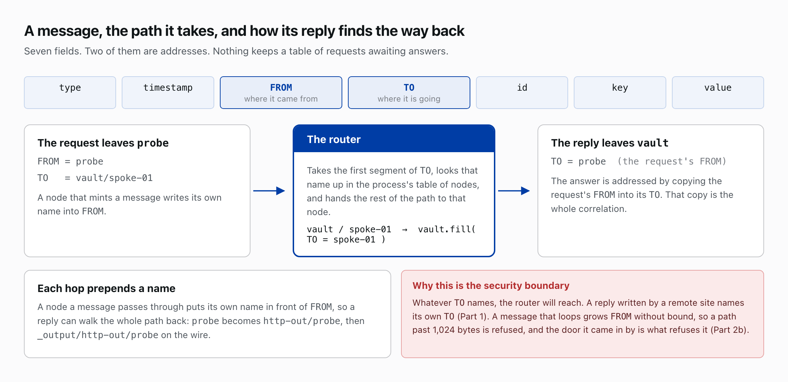
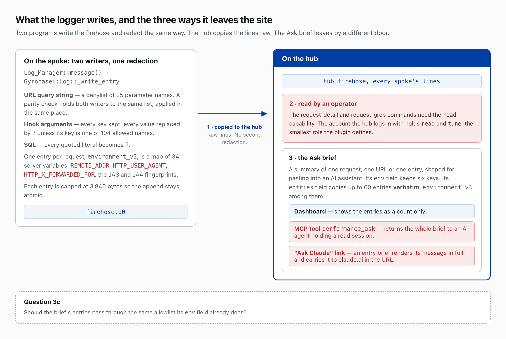
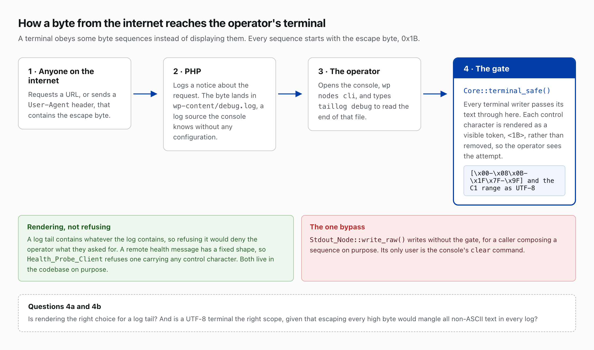

# What we asked SecOps to review
*Part 10 of 10 in Newspack Nodes and the Event Logger. Previous: Writing a plugin and running it.*

This is the review request as sent to SecOps.

*Chris, with the help of Claude.*

### What this is, and what I want

Two WordPress plugins run on staging. The `newspack-nodes` **hub** pulls log
data over HTTPS from 24 **spokes** (23 publications and a dev site) into one
`aggregator-hub` worker. `newspack-event-logger-nodes` writes each request's
performance to the firehose, which the hub copies raw.

Review `newspack-nodes` v2.55.3 and `newspack-event-logger-nodes` v0.95.3 at
those tags, not `main`. Linear holds an automated scan's tickets on five
surfaces: NPPM-3361 (3a), NPPM-3366 (3b), NPPM-3365 (3c), NPPM-3363 (Section 1)
and NPPM-3359 (Section 4). Judge the mechanisms in Sections 1 and 4;
fault the tradeoffs in Sections 2, 3, 5, 6 and 7 and in "What we have chosen to
live with", which are mine and in part recorded as architecture decisions; and
answer 3b's question about the edge, on which its score turns.

### Vocabulary

Part 2 defines message, `FROM`, `TO`, node, sink, router, reply and topology;
Part 3 the partition and the offsetlog. Two facts carry this request: the router
reaches whatever `TO` names, and a reply copies the request's `FROM` into its
`TO`, with no table of pending requests.

---

## Section 1: The hub/spoke trust boundary

**Code:** `newspack-nodes/includes/class-http-out-node.php`: `accept_inbound()`
(:467), `allow_replies_to()` (:836), `reply_allowed()` (:792),
`$reply_allowlist` (:112); `class-router-node.php`: `fill()`;
`class-remote-link-node.php`: `address_null_sink()` (:572);
`topologies/settings-sync.tsl`; `docs/architecture-decisions.md`, ADR-7.

Part 7 covers the reply gate: the spoke writes every field of a reply, `TO`
included, and each `HTTP_Out` node's `allow_replies_to` list decides what the
hub delivers.

**A spoke cannot run a command on the hub.** Part 5 covers signing. Only the
spoke mints sessions, and they sign the hub's commands to the spoke;
`Worker_Base:246` installs the HMAC check in every hub process; and
`Message::LOCAL` cannot cross the wire.

### The inventory: what an accepted `TO` can reach

An accepted `TO` reaches any node's `fill()` in the hub worker's process; the
four `complete` workers have their own tables. `ls` lists 241 names for 24
spokes: seven per spoke (a `Remote_Source` with its `:config`, `:sse-in`,
`:http-out`, `:null`, `firehose.p0:offsetlog` and `:deadletter`), two per
settings egress, and 25 shared. The table sorts all 40 `fill()` methods by what
an unsigned spoke-written message makes each do.

| Effect | Classes in the hub process | What a spoke-authored message does |
|---|---|---|
| **Appends it** | `Partition` (each spoke's offsetlog and deadletter, the firehose partitions behind `Topic`, the `topicprobe` log); `Log`, VALUE bytes only | Writes it, size-capped. **An offsetlog's last frame is where that spoke's reader resumes**, so a forged frame moves the hub's read position: the gate exists for this. |
| **Sends it outward** | `HTTP_Out` (per spoke and per settings egress), `Remote_Link` | Batches it to the spoke the node fronts, a relay whose ingress applies this same table. |
| **Stages configuration** | `Settings_Sync` | Re-sends one registered option to its registered destination. |
| | `Discovery_Collector` | Adds hook and event names, through `sanitize_text_field`, to the hub-wide lists the rule editor offers, 10,000 per list. |
| **Interprets it** | `Command_Interpreter` | HMAC-verifies a command with empty `TO`; an unsigned one draws a `TM_ERROR` reply back along `FROM`. Forwards anything else. |
| **Forwards, filters or discards** | `Null`, `SSE_In`, `Callback` (discard); `Remote_Job_Rewrite`, `Echo`, `Tee`, `Tap`, `Grep`, `Age_Sieve`, `Value_Timeout`, `JSON_To_Struct`, `Struct_To_JSON`, `Lock`; `Topic_Probe`, `Fleet` and `Consumer`, which have no `fill()` and take the base forward | Re-addresses or drops, then returns it to the router and this table. The base forward fills an emptied `TO` from the node's default, so a message addressed to `topicprobe` lands in the probe log. |
| **Not in this process** | `Shell`, `Hook`, `Table`, `Job_Worker`, `Flame_Builder` and its `:auto-tuner`, `Graphite`, `Stdout`, `Stderr`, `Dumper`, `SSE_Out`, `HTTP_In`, `Probe_To_Graphite`, `Request_Builder`, `Job_Router` | Reaches nothing: `Topology_Loader` constructs a `Shell` without registering it, `Table_Node::table()` constructs without naming, and no hub topology makes a `Hook`. |

`Shell`, which parses text into commands signed with the process key, would
matter most; no worker's graph holds it. The `_repl` node a console talks to is
a partition.

**1a. The boundary lives in topology config.** The allowlist fails closed, and
each declaration is a hand-written hole: 48 here, `settings-sync` and
`discovery-collector` on each of 24 settings egresses. A missed one silently
drops that spoke's discovery replies, indistinguishable from a spoke with
nothing to report. The alternative, `HTTP_Out` admitting only replies to the
`FROM` values it mints per batch, is correlation state, which ADR-7 refuses.
**Which side of that trade is right?**

**1b. Should the reply leg honour a spoke-set `TO` at all?** Routing every reply
to the link's default destination removes the allowlist and its 48 declarations,
at the cost of one `HTTP_Out` per reply destination instead of one per link.

---

## Section 2: What the substrate trusts from stores and wires it does not own

### 2a. The shared-memcache salt

**Code:** `class-cache-backend.php`: `site()` (:181, :196), `salt()` (:482),
`ensure_salt()` (:445), the keyspace-split warning (:160-179);
`class-command-auth.php`: `session_address()` (:534).

On WP Cloud one memcached pool serves many sites, so every key carries a
per-install scope, `substr( md5( DB_NAME . ':' . base_prefix . ':' . salt() ),
0, 12 )`. A neighbour can work out the database name and the prefix, so only the
salt keeps the scope unguessable, and a guessable scope lets that neighbour
write a key this install reads. `Bootstrap::activate()` and the `admin_init`
self-heal (`class-bootstrap.php:263`, `:284`) call `ensure_salt()`, which mints
one only where none exists. Three readers trust such keys:
`Spawn_Coordinator::load_spawn_ts()` reads `last_spawn:`, where a planted
far-future timestamp reads as a worker just started, so nothing revives it;
`Aggregator_CI` shows `remote:{name}:{partition}`, the connection status
`write_status()` merges; and ELN's `Stats_Store` feeds the performance
dashboards.

**Is a random per-install salt the right protection, or should the scope derive
from the site secret**, as `session_address()` does for command sessions? Its
comment says *"the cache is shared infrastructure, not a trusted store."* Two
facts argue against copying it. Folding `wp_salt('nonce')` into `site()` risks
the split keyspace `site()`'s docblock warns about, and `wp_salt()` is
unavailable under the SHORTINIT boot, where `salt()` reads the option row
through `$wpdb` instead.

### 2b. The inbound `FROM` ceiling at `/command`

**Code:** `class-node.php`: `stamp_message()` (:310), `can_stamp()` (:336),
`MAX_FROM_SIZE` (:39); `rest/class-http-in-node.php`: `dispatch()` (:258),
`boundary_refusal()` (:326).

Part 2 covers the 1,024-byte `FROM` ceiling. `/command` checks it through
`can_stamp()` before accepting a message and answers an overflow with a refusal
frame, because the boundary can name the door an overflow came in by and the
router, a layer later, cannot (`class-http-out-node.php:450`). Enforcement is
the open question: `stamp_message()` returns `false`, its docblock says *"the
caller must drop the message on either"*, and a caller that ignores the return
compiles, passes review and ships. **Is that mechanizable, as a
`#[\NoDiscard]`-style contract or a lint rule?**

---

## Section 3: What the logger captures, and what crosses to the hub

### 3a. Redaction: three models for three kinds of data

**Code:** `class-log-manager.php`: `URL_REDACT_PATTERN` (:146), `message()`
(:1148); `Gyrobase/Log.pm`: `_redact_url` (:393), `_write_entry` (:1117);
`app/class-core.php`: `HOOK_ARG_KEEP` (:134), `shaped_argument()` (:325),
`without_literals()` (:820); `newspack-pyrobase/includes/runtime/class-log.php`:
`sql_shape()` (:534), `signature_shape()` (:574);
`tools/check-firehose-parity.py`; `tools/survey-firehose-keys.php`.

Part 6 covers the firehose. The PHP logger and the Perl template engine both
write it; the logger records each request's URL in full, query string included.
The hub pulls as the `newspack_nodes_hub` role, `read` and `tune` only
(`class-roles.php:114-117`), and `read` alone opens the request-detail and
request-grep commands, so the hub sees them all. `Log_Manager::message()` and
`Gyrobase::Log::_write_entry` run `URL_REDACT_PATTERN` over every string
message, and `check-firehose-parity.py` asserts all three properties: the two
patterns are identical, each applies where the message is assembled, and neither
touches the queued job body, which is what the hub runs the job from.

Three models redact:

- **SQL.** Every quoted literal becomes `?`, comments are dropped, an `IN (…)`
  list collapses to one placeholder, and identifiers stay, since SQL has no keys
  to allowlist. This covers the `sql` span, any hook argument opening with a
  statement keyword, and the query signature, where `signature_shape()` blanks
  attribute values and keeps class and options.
- **Structured hook arguments.** As JSON, they keep every key and blank every
  leaf whose key is not in `HOOK_ARG_KEEP`. Its 104 names come from a census of
  two live hosts (243 and 254 distinct keys) and admit only structure: `is_*`
  conditionals, counters, pagination, behaviour flags, enumerated states, and
  the request-shape half of `http_request_args`. Across the census it blanks
  `meta_value` on 35,096 entries, `post_password` on 10,837, `token` on 546,
  `user_pass` and `user_activation_key` on every `WP_User` row, and
  `comment_author_email` and `comment_author_IP` on every comment row.
- **URL query parameters.** A denylist of 25 names governs these: the censuses
  show 96 and 62 distinct parameters, most diagnostic (`page`, `action`,
  `rest_route`, `oid`, `film`, `sort`, `utm_*`), and the performance dashboard
  groups by URL, so an allowlist does not fit. The census surfaces `client`,
  `sig`, `signature` and `appid` carrying credential-shaped values, and one
  `user_email`; the pattern names `client`, `sig` and `signature`, and `appid`
  and `user_email` pass.

**(a) Is a denylist plus a periodic census acceptable for the URL surface? (b)
`user_email` and `email` are personal data, not credentials, and sometimes the
thing being debugged. Redact them or not?**

### 3b. The request id

**Code:** `class-log-manager.php` (:962-968): `HTTP_X_A8C_REQUEST_ID`, else
`UNIQUE_ID`, else a generated id, capped at 64 bytes.

The request id groups a request's firehose lines and comes from the
`X-A8C-Request-Id` header when present. **Does WP Cloud overwrite that header at
the edge?** If it does not, a client can pick its own id and collide with or
forge another request's.

### 3c. The Ask brief

**Code:** `app/class-ask-assembler.php`: `entry_shape()` (:373), `for_request()`
(:85, the entry map at :96-99), `ENV_ALLOWLIST` (:76);
`app/class-performance-ci-node.php`: `ask_request()` (:1311);
`app/class-mcp-controller.php` (:136-141); `askBrief.js:186-188`, the `entry:`
case (:276) and `askClaudeUrl()` (:35).

An Ask brief summarizes one request, URL or log entry for pasting into an AI
assistant. Its `env` field passes a six-key allowlist (method, request_method,
status_code, worker_type, partition, server_name); its `entries` field does not:
`for_request()` copies up to `MAX_ENTRIES` (60) entries verbatim through
`entry_shape()`, `environment_v3` among them, a map of 34 server variables
including `REMOTE_ADDR`, `HTTP_USER_AGENT`, `HTTP_X_FORWARDED_FOR` and the JA3
and JA4 TLS fingerprints. The dashboard shows a request brief's entries as a
count, so the map leaves by two other doors: the `performance_ask` MCP tool, to
any agent holding a read-scoped session, and a single-entry brief, rendered in
full (`askBrief.js:276`) and carried to claude.ai in the "Ask Claude" query
string (`askClaudeUrl()`). **Should `entry_shape()` apply the assembler's
allowlist?**

---

## Section 4: What reaches the operator's terminal

**Code:** `class-core.php`: `terminal_safe()` (:622), `CONTROL_CLASS` (:56),
`CONTROL_SCAN` (:73); `class-stdout-node.php`: `write()` (:104), `write_raw()`;
`class-tty-out-node.php`; `class-log-sources.php`: `tail_file()`.

A visitor's URL or `User-Agent` carrying the escape byte `0x1B` reaches
`wp-content/debug.log` through a PHP notice, and `taillog debug` in `wp nodes
cli` prints it to the operator's terminal. Every terminal writer passes its text
through `Core::terminal_safe()`, which renders each control character as a
visible token such as `<1B>`, inverse video on a TTY, because a stripped byte
hides the attack from the reader. `CONTROL_CLASS` is
`[\x00-\x08\x0B-\x1F\x7F-\x9F]`; `CONTROL_SCAN` adds the C1 range in UTF-8
(`\xC2[\x80-\x9F]`). `Stdout_Node::write_raw()` bypasses it for a caller
composing a sequence on purpose, and the console's `clear` command is its only
user.

**4a. Rendering rather than refusing, for a UTF-8 terminal.** `terminal_safe()`
refuses nothing, where `Health_Probe_Client::valid_result()` refuses a remote
health message carrying any control, line-separator or paragraph-separator
character: that message has a fixed shape, and a log tail holds whatever the log
holds. It defends UTF-8 mode, the mode every terminal reading these logs runs
in; another mode means escaping every high byte and mangling every non-ASCII log
line. **Is rendering right for the tail, and is UTF-8 the right scope?**

---

## Section 5: The Vault's cryptography

**Code:** `class-vault.php`: `encrypt()` (:330), `decrypt()` (:553),
`encryption_key()` (:578), `require_sodium()` (:592), `get_all()` (:494);
`rest/class-vault-ci-node.php`: the `add` and `update` verbs.

Part 7 covers the Vault. It seals each password with `sodium_crypto_secretbox`,
keyed by `sodium_crypto_generichash( wp_salt( 'auth' ), '', 32 )` under a fresh
`random_bytes` nonce, and stores it in an option as `$enc$` plus the base64 of
nonce and ciphertext. Without libsodium `encrypt()` and `decrypt()` throw
through `require_sodium()`, so `vault add` and `vault update` fail loudly rather
than store.

- **The key derives from the auth salt.** Rotating `AUTH_KEY` or `AUTH_SALT`
  makes every sealed value unreadable, with no re-key path. **Is a key derived
  from a value WordPress expects operators to rotate the right choice?**
- **An unsealed stored value reads as empty.** `add()` and `update()` always
  seal, so a password without the `$enc$` prefix can only come from database
  write access, and `get_all()` treats it as empty. The config file is the
  operator's own and is read as written. **Is the line, sealed in the option and
  plain in the file, drawn in the right place?**

---

## Section 6: The JavaScript surface

**Code:** the 314 non-test JavaScript files under the two `src/` trees.

- **One HTML sink**, `PerformanceDashboard.js:852-856`, is a `<script
  type="application/json">` element of page facts; `factsJson()` escapes `<` to
  `\u003C` and both Unicode line terminators, the correct guard for that
  context.
- **One `href` built from data**, `CurrentRequestTab.js:162`, joins an admin URL
  PHP supplies to `encodeURIComponent( rid )`.

Everything else renders through React text nodes; browser storage holds layout,
theme, panel heights and telemetry counters; the two `style` values built from
data are numeric percentages; and neither tree holds an `innerHTML`, `eval`,
`new Function`, `document.write` or `postMessage` listener. Part 8 covers the
browser runtime. Its `HttpOutNode` carries no reply allowlist, because its
remote is the server the operator is logged into and the browser itself mints
every address that comes back (`src/runtime/http-out-node.js:277`). **Is that
exemption sound?**

---

## Section 7: The surfaces the sections above do not name

**Code:** `rest/class-auth-controller.php` (:110),
`rest/class-spawn-controller.php` (:84-97, :252),
`rest/class-health-cache-controller.php` (:89-97),
`rest/class-http-in-node.php` (:184-187, :384),
`rest/class-sse-out-node.php` (:1117-1123);
`class-command-interpreter-node.php`: `READ_VERBS` (:171), `capability_for()`
(:360); `class-log-sources.php`: `parse_entry()` (:557); `class-config.php`:
`assert_within_base()` (:110); `rest/class-topologies-ci-node.php` (:603);
`class-job-worker-node.php` (:207-218); ELN `app/class-mcp-controller.php`
(:181-193), `mu-plugins/00-newspack-profiler.php` (:173-180);
`newspack-pyrobase/includes/runtime/class-evtemplate.php`: `is_this_server()`
(:291).

Part 5 covers capabilities and sessions. I find every other door checks what it
should:

| Door | Who opens it | What it checks |
|---|---|---|
| `POST /v1/auth`, minting a command session | `read` | Fleet gate; scope clamped to the caller's roles; lifetime 60 seconds to one day. |
| `POST /v1/workers/spawn` | An internal 10-second token, or `manage` with a nonce at one call per two seconds | Token, capability, rate limit, nonce, in that order; type and partition checked against the active set. |
| `POST /v1/health/cache` | An internal token | Shape, then HMAC with the purpose inside the hash; the handler reads nothing from the request. |
| `POST /v1/command` | `read`, 30 posts per second | HMAC on every wire command; a role on every verb; the graph vocabulary pinned to `manage`. |
| Both event streams | `read`, no nonce | Roots confined to the three log groups; `..` refused. |
| The MCP server | A bearer credential naming a live session, 20 calls per ten seconds | Strict shape; constant-time key compare; scope can only subtract from the session's. Two tools write; both need `tune`. |
| The four `admin_post` handlers | `manage` with a nonce | Nonce, then capability. |
| The settings page, sole writer of `log_sources`, `memcache_servers`, `base_directory` and the TLS toggles | Literal `manage_options` | WordPress enforces `manage_options` on the option group; `settings set` accepts only bounded integers. |
| `sessions`, `vault`, `workers restart` and `topologies` verbs | `manage` | Names through one regex; integers through a refusing read; URLs `https://` only. |
| `layouts save` | `tune` | Name, size and every coordinate, before a byte is written. |
| `wp nodes ingest`, `scaffold`, `cli`, `run` | A shell as the site user | Root refused; input files must exist; `ingest` does not confine its destination, which a shell reaches anyway. |
| The profiler mu-plugin | Every request | Per-plugin load timings only, once the logger has started. |
| The TLS toggles `spawn_verify_ssl`, `vault_verify_ssl`, `vault_require_ssl` | The config file | Default on; the Vault refuses `http://` regardless; the last matters only for entries hand-written into the config file. |

Four need a paragraph each.

**7a. `read` reaches every registered log source.** `taillog` is one of the
eleven read-only builtins the command endpoint exempts from `manage` (Part 5),
and the log stream itself needs only `read`, so any `read` holder can pull the
last 64 KB of the PHP error log. That is by design: the capability's docblock
says `read` reaches the raw firehose.

**7b. `log_sources` accepts any absolute path.** An administrator adds
`name=/path`; the parser refuses only a relative path, `..` and NUL. With 7a,
adding `wp-config.php` hands every `read` account the salts the command-signing
secret and the Vault key derive from. Only `manage_options` can add a source, so
this is a mistake rather than an escalation, but the parser could refuse it.
**Should it: an allowlist of roots, or a denylist of extensions?**

**7c. What `manage` can mount.** A worker evaluates a saved topology as trusted
local commands, so a `manage` holder mounts any node class, `Hook` included,
which fires a WordPress action with the payload.
`assert_within_base()` confines every storage path to the runtime directory,
lexically with `..` resolved, so nothing lands in the webroot. `manage` is
administrator power by another name, and the request treats it so.

**7d. A spoke's job runs on the hub.** Part 7 covers `Remote_Job_Rewrite`. The
hub runs a spoke's `remote_job` entries through whatever `remote_job_handlers`
registers: neither plugin under review registers anything, and pyrobase's
deployed hub config registers `evtemplate`, so a spoke can have the hub render
one of the hub's own templates with the spoke's parameters as the request.
**That is a requirement: foundation community sites depend on the hub running
their jobs.** `is_this_server()` compares the job's template host to the
worker's `SERVER_NAME`; a worker spawned over HTTP has one, and one started with
`wp nodes run` has none and accepts every host. Pyrobase is out of scope and the
hub is not, so this names the path and leaves `is_this_server()` to pyrobase's
review.

## What we have chosen to live with

- **Multi-tenancy is by convention.** One hub worker holds every spoke's nodes
  in one flat table keyed by name.
- **Fail-soft stats, fail-closed SSE slots** (ELN `AGENTS.md`, decision 3; Part
  8). A cache failure shows "no data" and refuses new streams with HTTP 429,
  because the slot pool is the rate limit.
- **Salt rotation is the schema migration** (ELN `AGENTS.md`, decision 5). Keys
  carry no version component and readers probe no shape; skipping the rotation
  on a deploy costs one retention window of garbage.
- **The `@wordpress/*` `wp-7.0` pin** (Part 8). We dismiss, with a written
  reason, any advisory reachable only past the pin.
- **The event streams carry no nonce** (Part 8). A `read` user lured to a
  hostile page can have a stream opened in their name, but the browser withholds
  the body from that page, so the cost is a held slot, and the slot pool is the
  limit.
- **A live stream outlives the authorization that opened it.** The server checks
  permission once, at connect, and caps no duration, so a reader excluded
  afterwards keeps receiving the raw firehose until the connection drops. The
  client refreshes its slot lease by heartbeat; the server only checks.

## Dependencies, CI and the release path

A GitHub Actions workflow builds each release from exactly the packages the
committed lockfile names; two of its four third-party actions are pinned to a
commit and two to a major version the owner can move, and event-logger-nodes
checks the substrate out by a movable version tag. `newspack-nodes` has no open
advisory in npm or composer; `newspack-event-logger-nodes` has two, `uuid` and
`colord`, dismissed under the pin rule above, since each arrives only through
`@wordpress/components`, which the build replaces with the copy WordPress loads,
the zip omits `node_modules`, and `colord` cannot move under the pin because the
`wp-7.0` `rich-text` requires 2.9.3. The two high findings `npm audit` adds,
`js-yaml` and `nanoid`, are build-time tools that never ship, composer requires
only PHP in either repo, and `vendor/` stays out of the zip.

The GitHub Release is a record, not the artifact anyone installs. Sites run a
zip the deploy script builds from `main` and installs over SSH beside the site's
config file, which carries no credential. The script and its transport are out
of scope.

## What the sweep did not examine

**Everything outside these two plugins.** The sweep reads other code only where
it writes the firehose or calls into the two trees, and follows nothing past
that boundary, nor the Perl engine's page-side `_sanitize_url` and
`sanitize_url_for_error`, which touch no log.

cc: +vipsyseng, +loopp2. I'll nudge #secops with the link.

*Part 10 of 10 in Newspack Nodes and the Event Logger. Previous: Writing a plugin and running it.*
