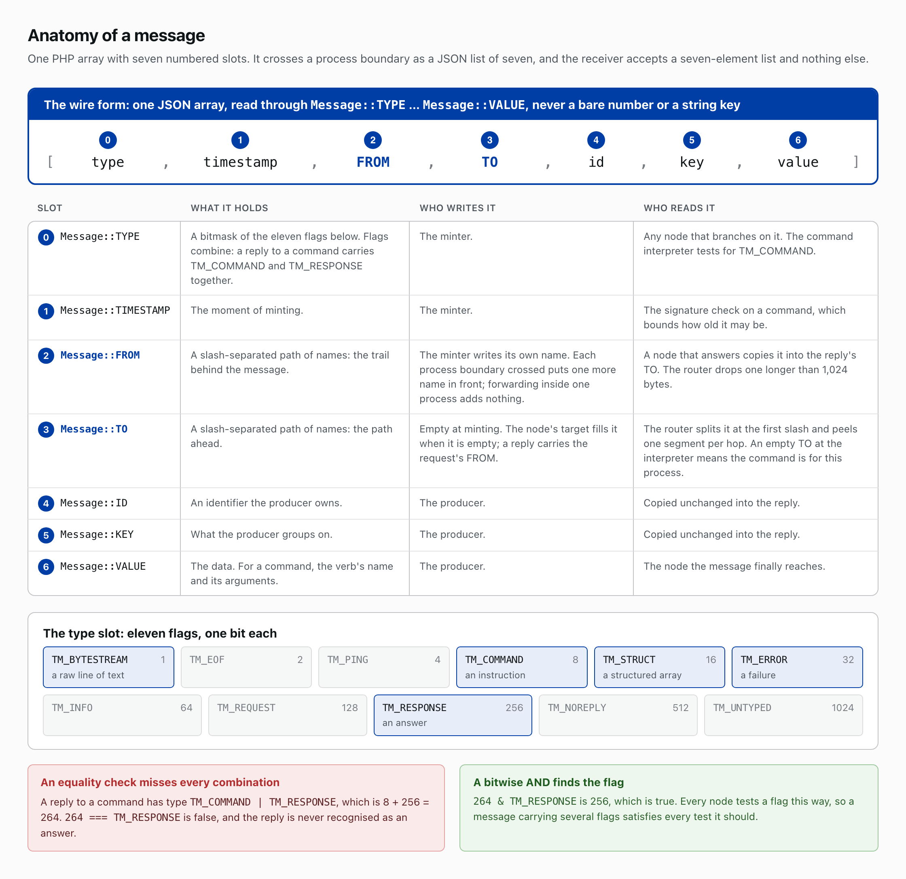
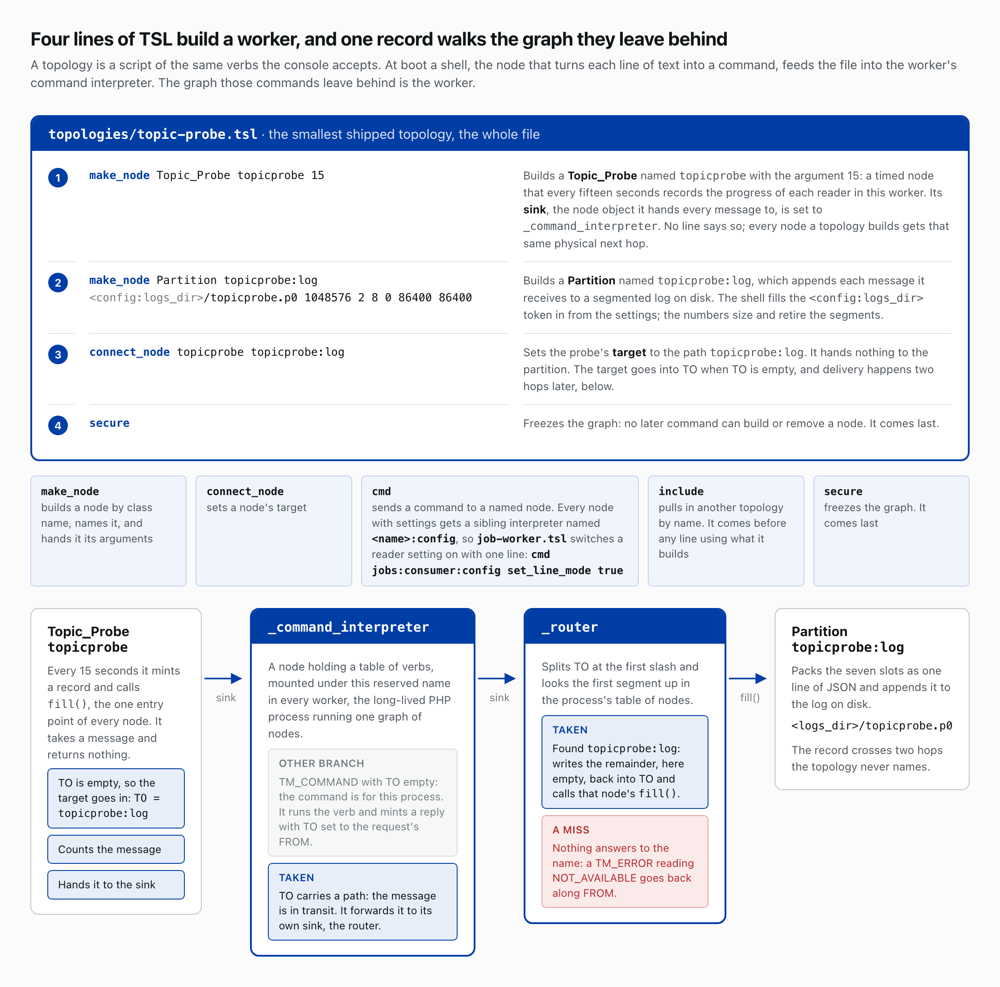
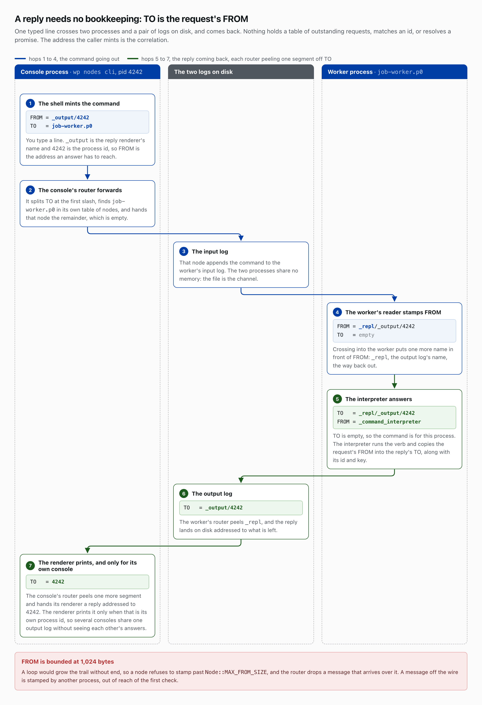

# The vocabulary

Six words carry the rest of the chapters: message, node, sink, target, router and topology. Each one is defined here once.

## The message

A message is one PHP array with seven numbered slots: type, timestamp, FROM, TO, id, key and value. Code reads each through a constant on the `Message` class, `Message::TYPE` through `Message::VALUE`, never through a bare number or a string key. A numbered slot costs less than a hash key on the runtime's busiest path, so the format is an array, not an object ([ADR-2](architecture-decisions.md#adr-2-one-message-format-the-7-field-positional-array)). [architecture-decisions.md](architecture-decisions.md) records the architecture decisions, and the chapters cite them by number. Across a process boundary the array travels as a JSON list of seven, and the receiver accepts nothing else.

The type slot is a bitmask of eleven flags, one bit each: TM_BYTESTREAM is a raw line of text, TM_COMMAND an instruction, TM_STRUCT a structured array, TM_ERROR a failure and TM_RESPONSE an answer, and the other six are TM_EOF, TM_PING, TM_INFO, TM_REQUEST, TM_NOREPLY and TM_UNTYPED. Flags combine, so a reply to a command carries TM_COMMAND and TM_RESPONSE together, 8 + 256 = 264, and a node tests for a flag with a bitwise AND: `264 & TM_RESPONSE` is 256, where `264 === TM_RESPONSE` is false and misses every combination.

Timestamp is the moment of minting, and the signature check on a command reads it to bound how old the command may be. FROM and TO are slash-separated paths of names, the trail behind the message and the path ahead of it. Value is the data, for a command the verb and its arguments; key is what the producer groups on; id is an identifier the producer owns.

## The node, its sink and its target

A node has one entry point, `fill()`, which takes a message and returns nothing ([ADR-1](architecture-decisions.md#adr-1-uniform-fill-contract), [ADR-13](architecture-decisions.md#adr-13-fill-returns-nothing)). Whatever a node learns leaves as another message, so any node composes with any other and a test runs three lines: build a message, fill it, assert on what comes out.

Every node carries a sink and a target, and only the target is yours to write. The sink is another node object, the physical next hop; the target is a string path. The base `fill()` writes the target into an empty TO, counts the message, and hands it to the sink ([ADR-7](architecture-decisions.md#adr-7-sink-vs-target-and-tofrom-replies)). Every node a topology builds gets the same sink, the command interpreter, and delivery happens two hops later.

## The command interpreter and the router

A command interpreter is a node holding a table of verbs, and every worker, the long-lived PHP process running one graph of nodes, mounts one under the reserved name `_command_interpreter`. A command is a message carrying TM_COMMAND whose value names a verb and its arguments. With an empty TO it is for this process: the interpreter runs the verb and mints a reply. With a TO it is in transit, and goes on to the interpreter's own sink, the router.

The router, `_router`, splits TO at the first slash, looks the first segment up in the process's table of nodes, writes the remainder back into TO, and calls that node's `fill()`. A name nothing answers to draws a TM_ERROR reading NOT_AVAILABLE, sent back along FROM.

## Topologies: the TSL files

A topology is the `.tsl` file declaring a worker's graph, a script of the same verbs the console accepts. At boot a shell, the node that turns each line of text into a command, feeds the file into the worker's interpreter, and the graph those commands leave behind is the worker. `make_node` builds a node by class name, names it and hands it its arguments; `connect_node` sets its target; `cmd` sends a command to a named node, and every node with settings gets a sibling interpreter named `<name>:config`, so `job-worker.tsl` switches a reader setting on with the one line `cmd jobs:consumer:config set_line_mode true`; `include` pulls in another topology and comes before any line using what it builds; `secure` comes last and freezes the graph, so no later command can build or remove a node.

The smallest shipped topology, `topologies/topic-probe.tsl`, is four lines. Line one, `make_node Topic_Probe topicprobe 15`, builds a timed node that every fifteen seconds records the progress of each reader in this worker. Line two, `make_node Partition topicprobe:log <config:logs_dir>/topicprobe.p0 1048576 2 8 0 86400 86400`, builds a partition, which appends each message it receives to a segmented log on disk; the shell fills the `<config:logs_dir>` token in from the settings, and the six numbers size and retire the segments. Line three, `connect_node topicprobe topicprobe:log`, sets the probe's target, and `secure` ends the file. Each record crosses the interpreter and the router, two hops the topology never names, and lands in the partition as one line of JSON.

[Logs on disk](logs-on-disk.md) opens that log and reads the numbers on line two.

## The reply

A node answering a message copies the request's FROM into the reply's TO, with the request's id and key ([ADR-7](architecture-decisions.md#adr-7-sink-vs-target-and-tofrom-replies)). Nothing keeps a table of outstanding requests, matches an id, or resolves a promise: the address the caller mints is the correlation.

Suppose `wp nodes cli` opens a console with process id 4242. A typed line leaves with TO `job-worker.p0`, the worker's name, and FROM `_output/4242`, the reply renderer's name and the process id, so FROM is the address an answer has to reach. The console's router hands it to the node of that name, which appends it to the worker's input log, the only channel the two processes share. The worker's reader prefixes `_repl`, the output log's name, to FROM. TO is empty by then, so the interpreter runs the verb and answers to `_repl/_output/4242`, with its own name in FROM. Each router on the way back peels one segment: the worker's lands the reply in the output log addressed to `_output/4242`, and the console's hands its renderer one addressed to `4242`, printed only when that is its own process id. Several consoles share one output log without seeing each other's answers.

## FROM has a ceiling

A node that mints a message writes its own name into FROM, and each process boundary crossed puts one more name in front; forwarding inside one process adds nothing. A loop would grow the trail without end, so `Node::MAX_FROM_SIZE` bounds it at 1,024 bytes. A node refuses to stamp past that ceiling, and the router drops any message arriving over it, because a message off the wire is stamped by another process, beyond the first check.

## Read more

- [`architecture-guide.md`](architecture-guide.md#message-format), the sections [Message Format](architecture-guide.md#message-format) through [Topologies](architecture-guide.md#topologies-tsl)
- [`architecture-decisions.md`](architecture-decisions.md#adr-1-uniform-fill-contract), [ADR-1](architecture-decisions.md#adr-1-uniform-fill-contract), [ADR-2](architecture-decisions.md#adr-2-one-message-format-the-7-field-positional-array), [ADR-7](architecture-decisions.md#adr-7-sink-vs-target-and-tofrom-replies) and [ADR-13](architecture-decisions.md#adr-13-fill-returns-nothing)
- [`topologies/`](../topologies), the four shipped files
- `docs/notes/TSL.md`, which lives in the dndocker tree and has no public home

