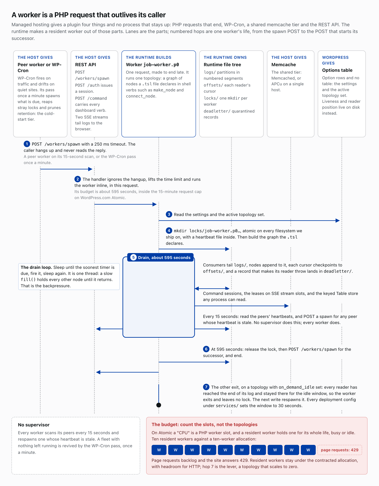
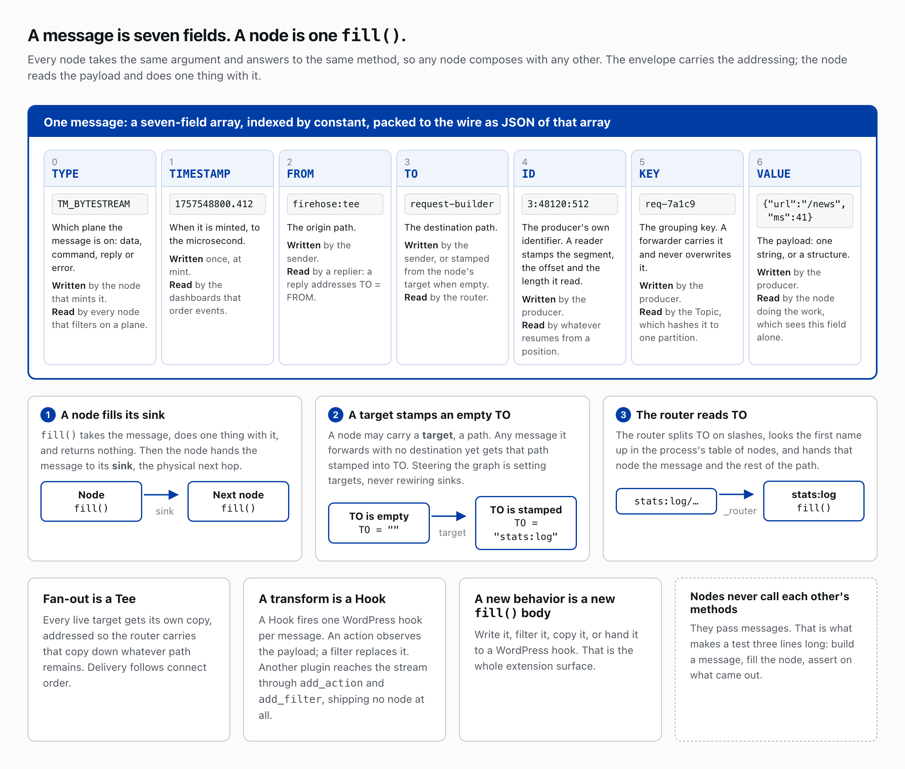
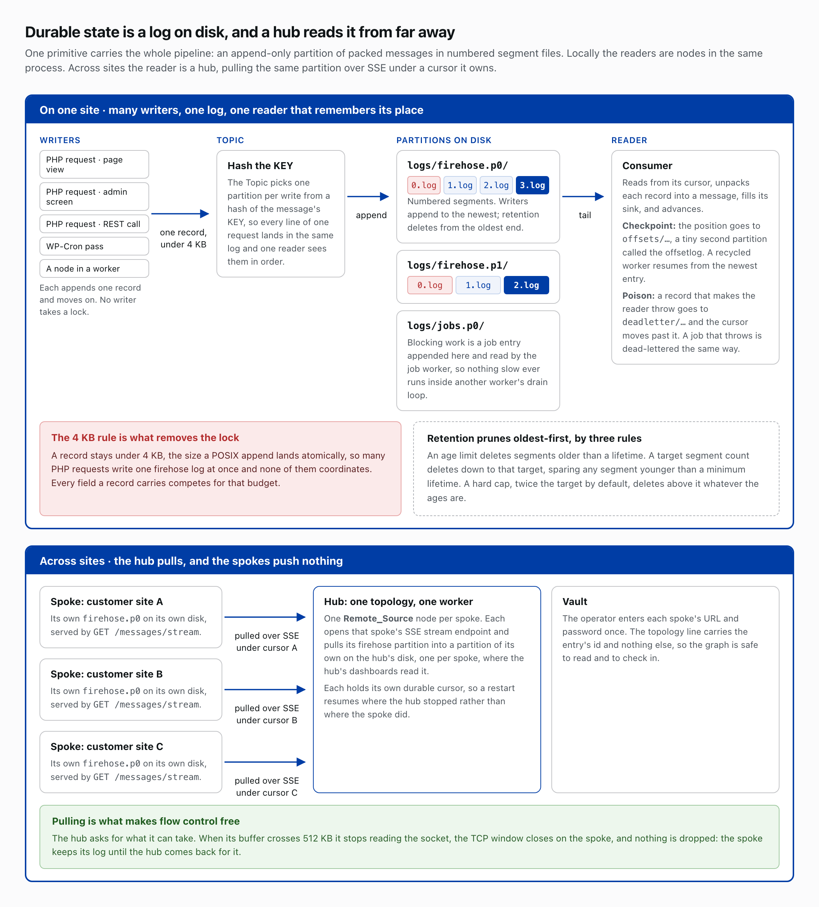

# Why a message runtime inside WordPress

## The problem

The goal is per-request performance logging: each request's URL, the hooks it fires, its payloads and where its time goes, collected from many customer sites and read in one place. That is a pipeline, and a pipeline wants a process that stays up. Managed WordPress hosting has none. A plugin gets four things: PHP requests that end; WP-Cron, which fires on traffic and drifts on quiet sites; a shared memcache tier; and the REST API. On the REST API the runtime registers `POST /workers/spawn`; `POST /auth`, which issues a session; `POST /command`, which carries every dashboard verb; and two SSE streams that tail logs to the browser. Newspack Nodes makes a resident worker out of those parts.

## The shape of the answer

A **topology** is one graph of nodes, declared in a `.tsl` file of shell verbs such as `make_node` and `connect_node`; a **worker** is the HTTP request that runs it and outlives its caller. The spawn is `POST /workers/spawn` with a 250 ms timeout, and the caller hangs up and never reads the reply. The handler ignores the hangup, lifts the time limit, reads the settings and the active topology set, and takes its lock: a `mkdir` under `locks/`, atomic on every filesystem we ship on, with a heartbeat file inside. Then it builds the graph the `.tsl` declares and drains it for about 595 seconds, inside the 15-minute request cap on WordPress.com Atomic. Draining is sleeping until the soonest timer is due, firing it, and sleeping again, on one thread, so a slow `fill()` holds every other node until it returns: that is the backpressure. At the end the worker releases its lock and POSTs its successor. There is no supervisor: every worker scans its peers every 15 seconds and POSTs a spawn for one whose heartbeat is stale, and the WP-Cron pass once a minute spawns what is due, reaps stray locks and prunes retention, so it revives a fleet with nothing left running.

Everything inside that worker is a **node**, and every node answers to one method, `fill()`, which takes a message, does one thing with it (writes it, filters it, copies it, or hands it to a WordPress hook) and returns nothing. A **message** is a seven-field array, indexed by constant and packed to the wire as JSON of that array: TYPE, the plane it rides on, data, command, reply or error; TIMESTAMP, the mint time to the microsecond; FROM, the origin path, which a reply addresses; TO, the destination path; ID, the producer's own identifier, which a reader overwrites with the segment, offset and length it read; KEY, the grouping key, which a forwarder carries and never overwrites; and VALUE, the payload, one string or a structure, the one field the working node reads. A node hands the message to its **sink**, its next hop, and may carry a **target**, a path stamped into an empty TO: steering the graph is setting targets, never rewiring sinks. The **router** splits TO on slashes, looks the first name up in the process's table of nodes, and hands that node the message and the rest of the path. Nodes pass messages and never call each other's methods. That uniformity is the whole bet: any node composes with any other, a test is three lines long (build a message, fill the node, assert on what came out), and another plugin extends the pipeline by writing one `fill()` body. Fan-out is a Tee: every live target gets its own copy, delivered in connect order. A transform is a Hook, which fires one WordPress hook per message; an action observes the payload and a filter replaces it, so a plugin reaches the stream through `add_action` and `add_filter` and ships no node at all.

Durable state lives in the runtime's file tree: `logs/` holds partitions in numbered segments, `offsets/` each reader's cursor, `locks/` one `mkdir` per worker, and `deadletter/` quarantined records. The database holds option rows and no table: the settings and the active topology set. The memcache tier (Memcached, or APCu on a single host) holds what every process must read at once: command sessions, the leases on SSE stream slots, and the keyed Table store. A **partition** is an append-only log of packed messages in numbered segment files. Writers append to the newest segment, and retention prunes oldest-first by three rules: an age limit, a target segment count that spares segments younger than a minimum lifetime, and a hard cap, twice the target by default, that ignores age. A record stays under 4 KB, the size a POSIX append lands atomically, so page views, admin screens, REST calls, the WP-Cron pass and nodes in a worker all append to one firehose log with no lock. Every field a record carries competes for that budget. A Topic hashes each write's KEY to one of several partitions, so one request's lines stay together and one reader sees them in order. A Consumer reads from its cursor, unpacks each record into a message, fills its sink, advances, and checkpoints its position to a tiny second partition, the offsetlog, so a recycled worker resumes from the newest entry. A record that makes its reader throw goes to a dead-letter partition and the cursor moves past it. Blocking work is a job entry appended to its own log and read by the job worker, so nothing slow runs inside another worker's drain loop, and a job that throws is dead-lettered the same way.

## A hub that pulls

A **hub** aggregates **spokes**, the customer sites it watches. For each spoke the hub's topology wires one Remote_Source node, which opens the spoke's `GET /messages/stream` and pulls that firehose partition over SSE into a partition of its own on the hub's disk, one per spoke, where the hub's dashboards read it. Each Remote_Source holds its own durable cursor, so a restart resumes where the hub stopped rather than where the spoke did. The Vault, a credential store the operator fills once, supplies each spoke's URL and password; the topology carries only the entry's id, so the graph is safe to read and to check in. The spokes push nothing; the hub asks for what it can take, so flow control is built in: when its buffer crosses 512 KB it stops reading the socket, the TCP window closes on the spoke, and nothing is dropped, because the spoke keeps its log until the hub comes back for it.

## The budget

The budget governs the design. On Atomic a "CPU" is a PHP worker slot, and a resident worker holds one for its whole life, busy or idle. Ten resident workers against a ten-worker allocation leave nothing for page requests, which backlog, and the site answers 429. Resident workers stay under the contracted allocation, with headroom for HTTP. The lever is a topology that scales to zero: with `on_demand_idle` set to an idle window, a worker whose readers have all reached the end of their logs waits out that window, exits and leaves no lock; the next write respawns it. Every deployment config under `services/` sets the window to 30 seconds. Count worker slots, not topologies.

## Read more

- [`README.md`](../README.md)
- [`architecture-guide.md`](architecture-guide.md)
- `docs/notes/atomic-php-workers-are-the-cpu-budget.md`, the note the worker-slot budget draws on; it lives in the dndocker tree and has no public home

