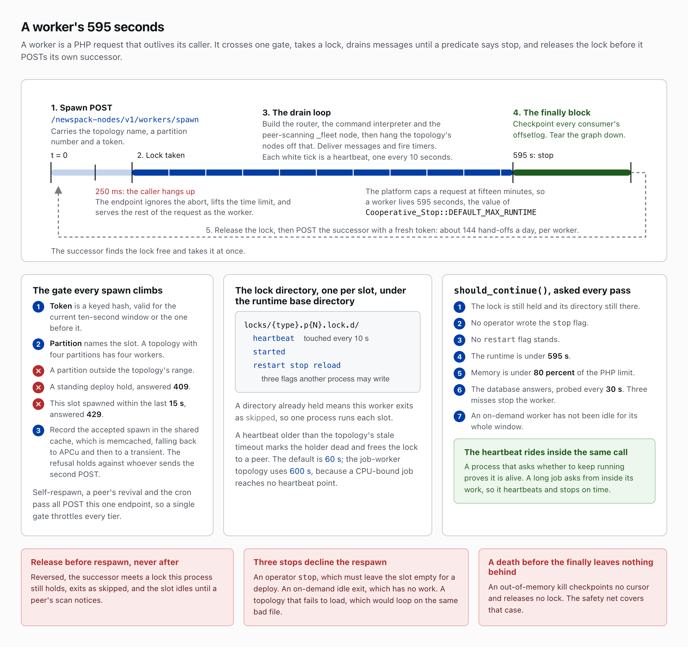
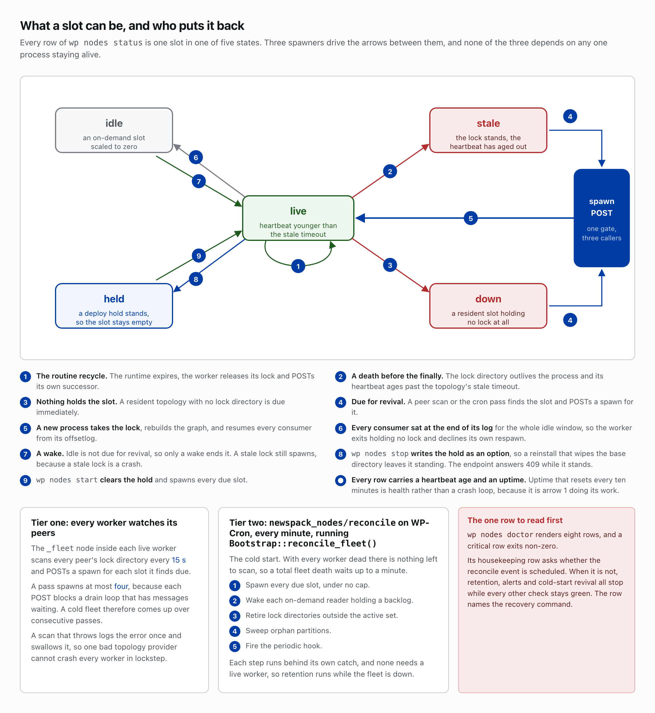
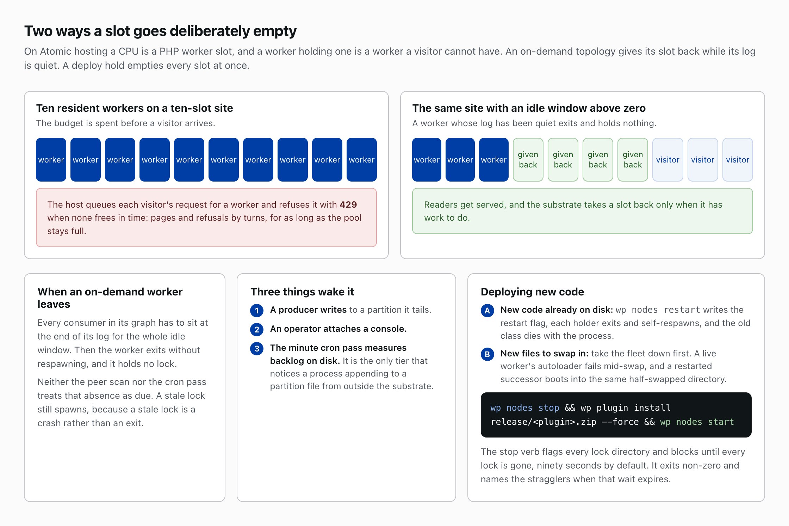

# Workers and the fleet

WordPress hosting offers no daemon, so a worker is a PHP request that outlives its caller: it takes the lock on one slot, one partition of one topology, drains messages for about ten minutes, and hands the slot to a successor it POSTs itself. The fleet is every such worker, and it keeps its own slots filled.

## Spawn

A worker begins as a POST to `/newspack-nodes/v1/workers/spawn` naming a topology, a partition (a topology with four partitions has four workers) and a token, a keyed hash good for the current ten-second window or the one before. The caller hangs up after 250 milliseconds; the endpoint ignores the abort, lifts the time limit and becomes the worker. The platform caps a request at fifteen minutes, so a worker lives 595 seconds, `Cooperative_Stop::DEFAULT_MAX_RUNTIME`. The endpoint refuses, in order, a partition outside the topology's range, a standing deploy hold (409) and a second spawn of one slot within fifteen seconds (429); it records each accepted spawn in the shared cache, memcached falling back to APCu and then to a transient, so the refusal holds against whoever sends the second POST. Self-respawn, peer revival and the cron pass all POST this one endpoint, so a single gate throttles every tier.

## Lock, heartbeat and the drain loop

The worker first takes its lock, the directory `locks/{type}.p{N}.lock.d/` under the runtime base directory; a directory already held means it exits as skipped, so one process runs each slot. Inside sit a heartbeat file touched every ten seconds, a started file and three flags another process may write: restart, stop and reload. A heartbeat older than the topology's stale timeout marks the holder dead and frees the lock to a peer. The default is sixty seconds; the job-worker topology uses 600, because a CPU-bound job reaches no heartbeat point.

The worker then builds the router, the command interpreter and the peer-scanning `_fleet` node, hangs the topology's nodes off that, and drains: it delivers messages and fires timers until `should_continue()` says stop. Each pass checks the lock, the stop and restart flags, the 595-second runtime, memory against 80 percent of the PHP limit, the database (probed every thirty seconds; three misses stop the worker) and, for an on-demand worker, the idle window. The heartbeat rides inside that call, and nothing outside a PHP request can interrupt the request, so a long job must call `should_continue()` from inside its own work to heartbeat and stop on time; code that never asks holds its slot until the platform kills it.

## Release, then respawn

When the predicate says stop, a `finally` block checkpoints every consumer's offsetlog, tears the graph down, releases the lock, then POSTs a successor for the same slot with a fresh token, about 144 hand-offs a day per worker. Release comes first so the successor takes the lock at once, rebuilds the graph and resumes every consumer from its offsetlog; reversed, the successor meets a held lock, exits as skipped, and the slot sits empty until a peer's scan notices. Three stops decline the respawn: an operator stop, which must leave the slot empty for a deploy; an idle exit, which has no work; and a topology that fails to load, which would loop on the same bad file.

## The safety net

A worker that dies before its `finally` checkpoints no cursor, releases no lock and POSTs nobody. Two tiers answer that.

Every fifteen seconds the `_fleet` node in each live worker scans its peers' lock directories and POSTs a spawn for each slot with no lock or an aged heartbeat, at most four per pass because each POST blocks a drain loop with messages waiting, so a cold fleet comes up over consecutive passes. A scan that throws logs the error once and swallows it, so one bad topology provider cannot crash every worker in lockstep.

`Bootstrap::reconcile_fleet()`, on the `newspack_nodes/reconcile` WP-Cron event every minute, is the cold start: with every worker dead there is nothing left to scan, so a total fleet death waits up to a minute. It spawns every due slot under no cap, wakes on-demand readers holding a backlog, retires lock directories outside the active set, sweeps orphan partitions and fires the periodic hook, each step behind its own catch and none needing a live worker, so retention runs while the fleet is down.

## On-demand workers

On Atomic a CPU is a PHP worker slot, and an idle worker holds one: ten resident workers on a ten-slot site spend the budget before a visitor arrives, and the host then queues each visitor's request for a worker and refuses it with 429 when none frees in time, so readers get pages and refusals by turns for as long as the pool stays full. A topology with an idle window above zero gives its slot back: once every consumer in its graph has sat at the end of its log for the whole window, the worker exits without respawning and holds no lock. Neither tier treats that absence as due, though a stale lock still spawns, because a stale lock is a crash. Three things wake it: a producer writing to a partition it tails, an operator attaching a console, and the minute cron pass measuring backlog on disk, the only tier that notices a write from outside the substrate. The resident set should hold only the topologies that cannot wait.

## Deploy holds

`wp nodes restart` writes the restart flag: each holder exits and self-respawns on the code already on disk. Swapping plugin files under a live fleet is different: a live worker's autoloader fails mid-swap, and a restarted successor boots into the same half-swapped directory. Take the fleet down: `wp nodes stop`, then `wp plugin install release/<plugin>.zip --force`, then `wp nodes start`. The stop verb writes the hold as an option, so a reinstall that wipes the base directory leaves it standing. It then writes the stop flag into every lock directory and blocks until every lock is gone, ninety seconds by default, naming the stragglers and exiting non-zero when the wait expires. The start verb clears the hold and spawns every due slot.

## What an operator reads

Each `wp nodes status` row is one slot in one of five states: live, a heartbeat younger than the stale timeout; stale, a lock whose heartbeat has aged out, which a peer or cron will steal; down, a resident slot holding no lock; idle, an on-demand slot scaled to zero; held, a deploy hold. Idle and held are deliberate, and uptime resetting every ten minutes is the routine recycle at work. `wp nodes doctor` renders eight rows, and a critical row exits non-zero. Its housekeeping row asks whether the reconcile event is scheduled; when it is not, retention, alerts and cold-start revival all stop while every other check stays green, and the row names the recovery command.

## Read more

- [architecture-decisions.md](architecture-decisions.md), [ADR-8](architecture-decisions.md#adr-8-worker-zombie-pattern), [ADR-9](architecture-decisions.md#adr-9-two-tier-safety-net) and [ADR-14](architecture-decisions.md#adr-14-cooperative-stop-propagates-through-broad-catches)
- [cli.md](cli.md)
- [troubleshooting.md](troubleshooting.md)
- `docs/notes/atomic-php-workers-are-the-cpu-budget.md`, which lives in the dndocker tree and has no public home

